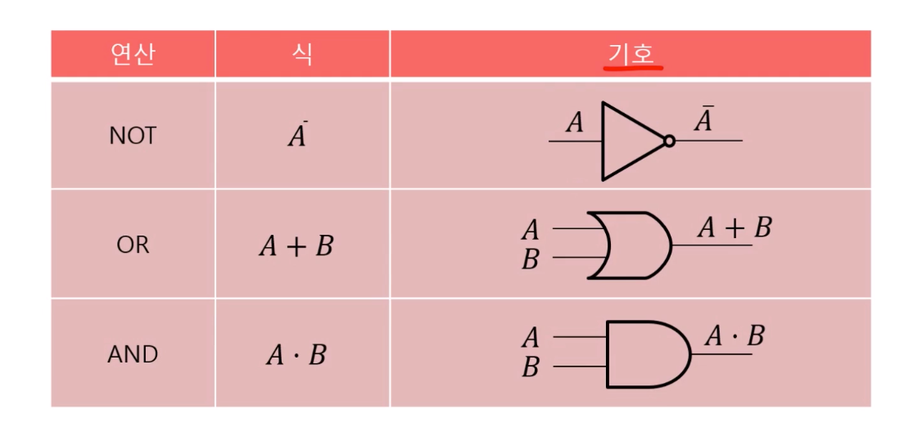
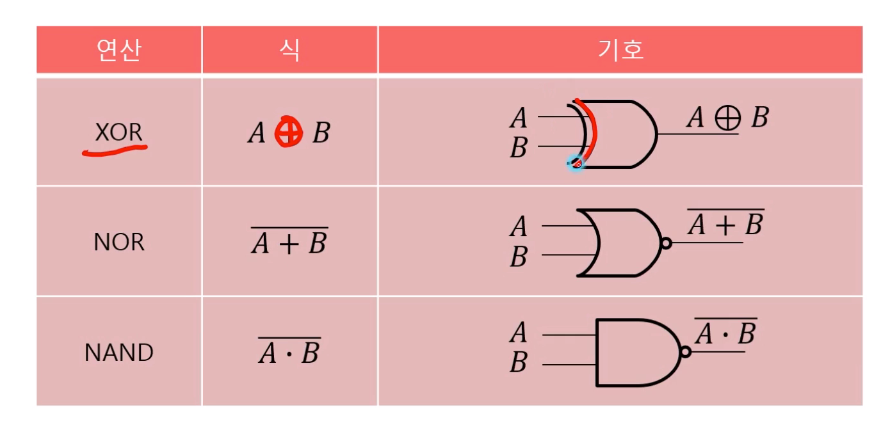
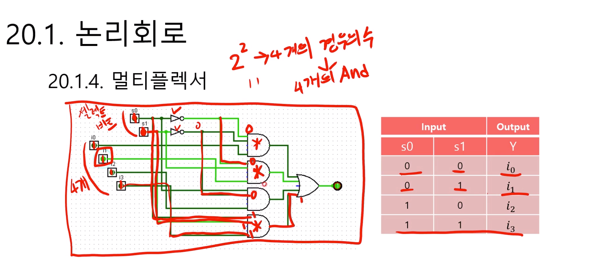
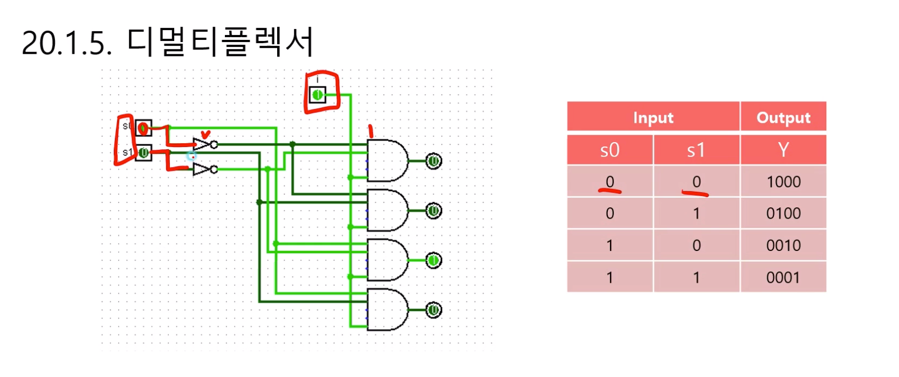

# 제 20강 논리회로 기초 part1 
## 1.1 논리회로의 정의 
- bool 대수를 물리적 장치에 구현한 것 
- 하나 이상의 논리적 입력값에 대하여 정의된 연산을 수행하고, 하나의 논리적 출력값을 얻는 전자회로 
- 논리식이나 진리표가 필수적으로 사용됨. 
- 종류로는 조합회로, 순차회로 등이 있음

## 1.2 조합회로 
- 입력 신호만으로 출력이 결정되는 회로 
- AND, NOT, OR, XOR과 같이 기본이 되는 논리연산을 수행하는 회로 

## 1.2 

**NAND**는 AND 연산 후 NOT을 해줌 

## 1.3 조합회로 심화 
- 멀티플렉서(MUX): 입력 신호 중 하나를 선택하여 출력하는 회로 
- 디멀티플렉서(DEMUX): 한 개의 입력신호에 대하여 다수의 데이터 출력선 중 하나를 선택하는 회로 
- 가산기(Adder): 2진수의 덧셈 연산을 수행하는 논리회로  

## 1.4 멀티플렉서 

## 1.5 디멀티플렉서 

