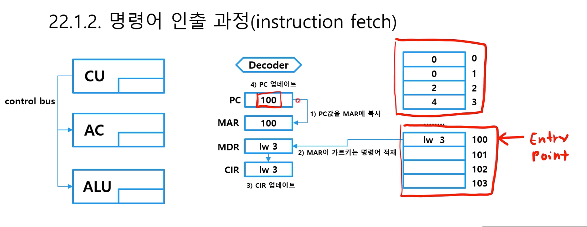
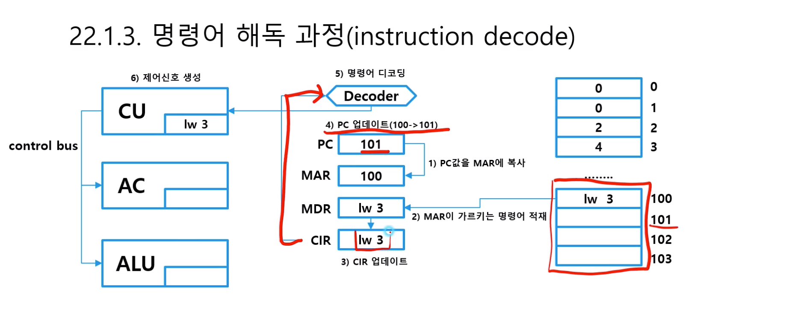
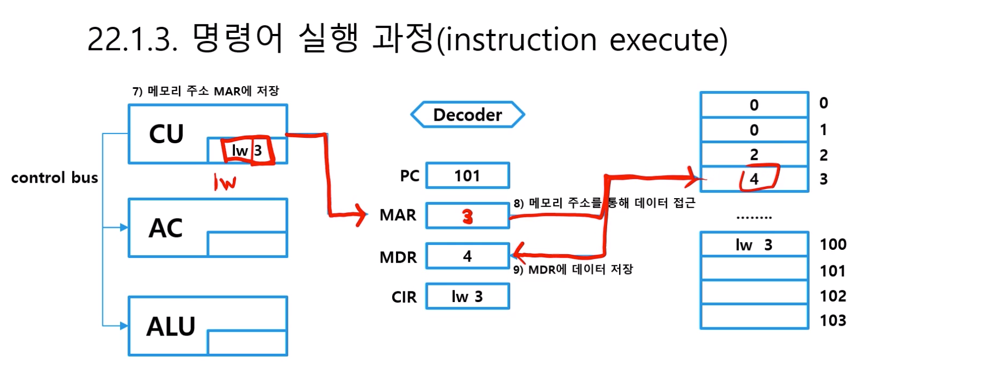
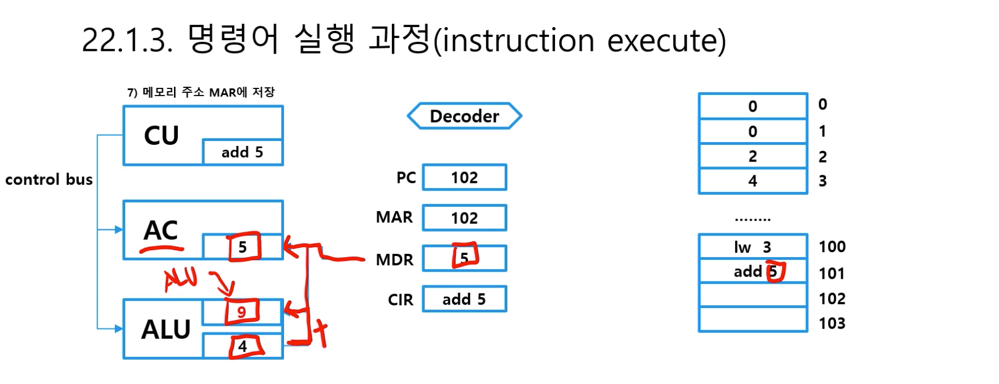

# 제 22강 프로세서 명령어 실행과정 
## 1.1 컴파일 과정 
Compiler -> Assembler -> Linker -> Loader -> Memory

## 1.2 명령어 인출 과정(instruction fetch)
- MAR(Memory Address Register), MDR (Memory Data Register)
- control bus : 신호의 통로 

## 1.3 명령어 해독 과정(instruction decode)

## 1.4 명령어 실행 과정(instruction execute)

