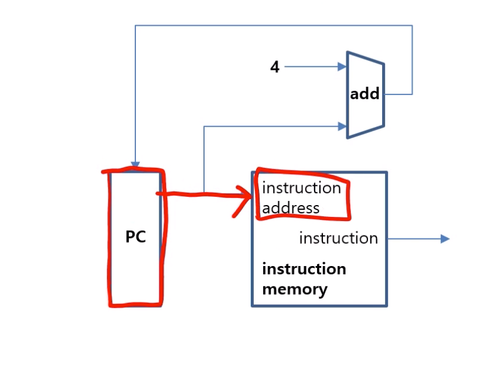
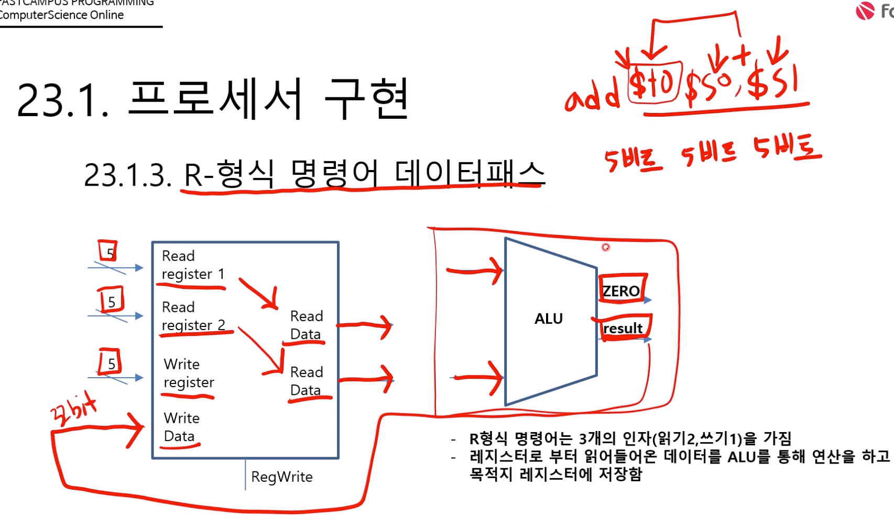
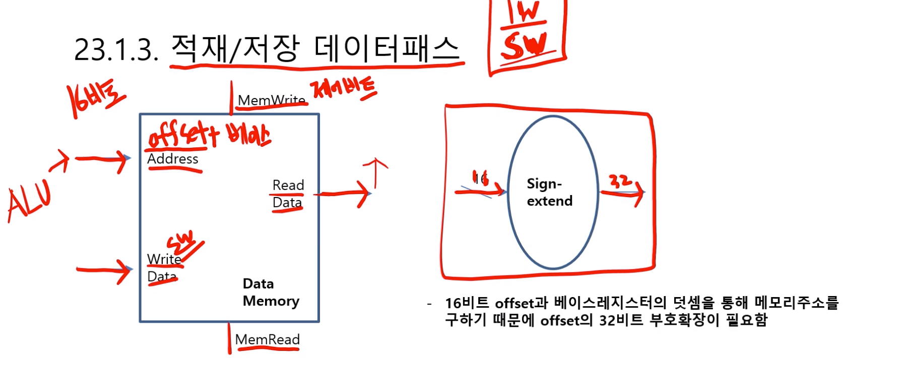
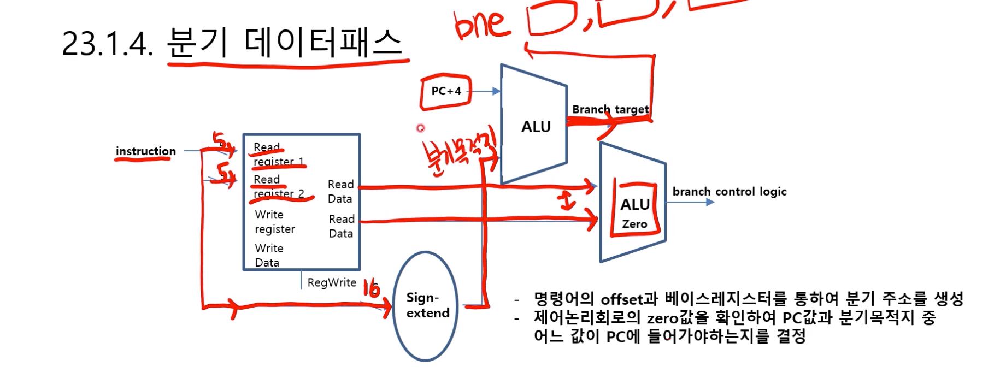
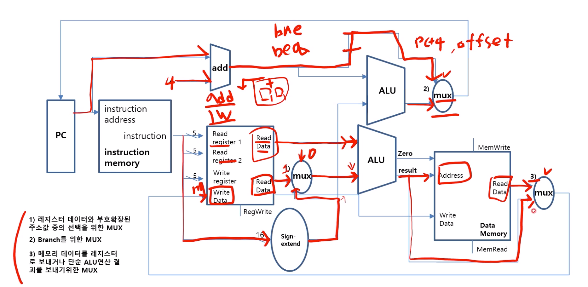

# 제 23강 프로세서 구현 
## 1.1 데이터 패스 
- 명령어가 프로세서로 가는 통로 
- 데이터패스는 조합소자와 상태소자로 이루어져있음 
- 조합소자: 같은 입력이 주어지면 항상 같은 출력을 내는 소자 
- 상태소자: 메모리, 레지스터와 같이 상태를 기억하고 있는 소자 

## 1.2 명령어 인출(fetch) 데이터패스 

- add는 산술연산만 하돌고 하드웨어적으로 구현 
- 명령어를 실행하기 위해서는 메모리에서 명령어를 인출해야함 
- 다음 명령어를 가르키기 위하여 PC의 값을 4만큼 증가시켜야함 

## 1.3 R-형식 명령어 데이터패스 

## 1.4 적재/저장 데이터패스 

- lw: 적재명령어 
- sw: 저장명령어 

## 1.5 분기 데이터 패스 
- beq : 인자 레지스터 2개, 분기 주소 1개  
- bne : 인자 레지스터 2개, 분기 주소 1개

## 1.6 전체 데이터 패스 
- mux: 멀티플렉서 (하드웨어의 제약이 따르기 때문에 멀티플렉서가 필요함 - 입력값 전부 들어가면 무리가 생김)

