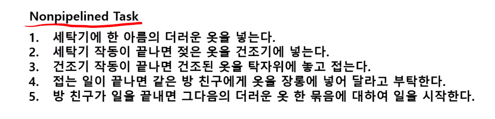
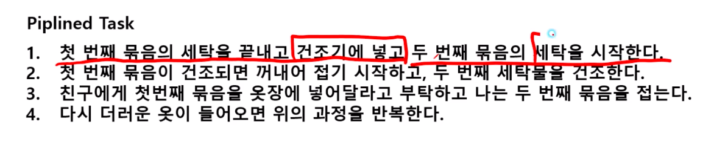
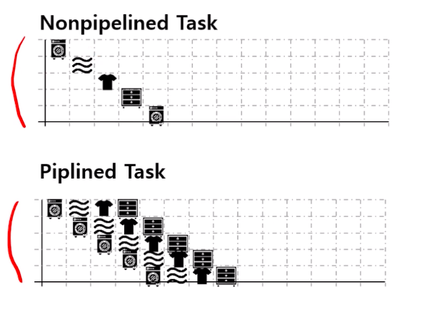
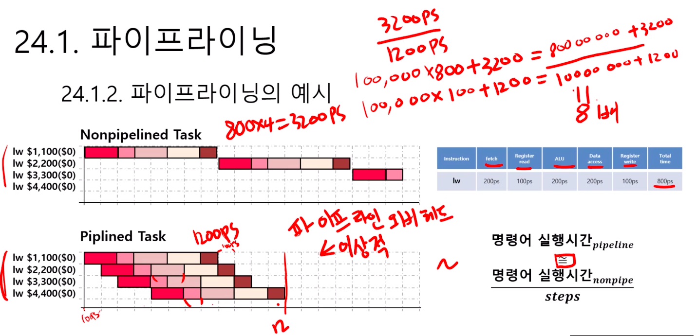
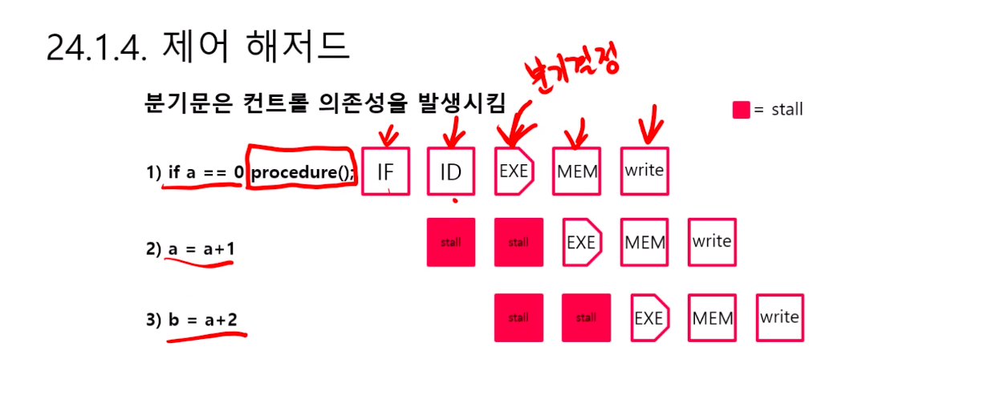

# 제 24강 파이프라이닝과 해저드 
## 1.1 파이프라이닝의 정의 
- 파이프라이닝은 여러 명령어가 중첩되어 실행되는 구현기술
- 한 데이터 처리단계의 출력이 다음 단계의 입력으로 이어지는 형태로 연결된 구조 
- 여러단계가 병렬적으로 수행될 수 있어 효율성이 향상됨 

## 1.2 파이프라이닝 예시 
### Nonpipelined Task

### pipelined task

### pipeline example

### pipeline explanation

## 2.1 해저드의 정의와 종류 
- 다음 명령어가 다음 클럭 사이클에 실행될 수 없는 상황 
- 해저드의 종류에는 구조적 해저드, 데이터 해저드, 제어 해저드

## 2.2 구조적 해저드 
- 클럭 사이클에 실행하기를 원하는 명령어의 조합을 하드웨어가 지원할 수 없다는 것을 의미 
- 세탁소 예시: 
  - 독립된 세탁기와 건조기가 아닌 세탁기와 건조기가 붙어있는 기계 
  - 친구가 다른 일을 하느라고 바빠서 빨래를 치우지 못했을 경우

## 2.3 데이터 해저드 
- 어떤 단계가 다른 단계가 끝나기를 기다려야 하기 때문에 지연이 생기는 경우 
- 명령어를 실행하는데 필요한 데이터가 아직 준비되지 않아서 계획된 명령어가 적절한 클럭사이클 시간에 실행될 수 없는 사건 
- 명령어 예시: 
  - add $s0, $t0, $t1 <- 실행중
  - sub $t2, $s0, $t3 <- 실행불가(위 명령어에 종속적임)

## 2.4 제어 해저드 
- 명령어 주소의 흐름이 파이프라인이 기대한 곳과 달라서 발생하는 해저드, 주로 branch나 jump에 의하여 발생 
- 명령어 예시:
  - beq $s0, $s1, Procedure <- 분기 True 
  - sub $t2, $s0, $t3 <- 분기가 True일때 실행불가 
  - add $t2, $s0, $t3 <- 분기가 True일때 실행불가 
  - 분기를 탈지 말지 모를때 실행하는 건 낭비이므로 실행불가 

  
> 파이프라인에서 지연을 **stall** 이라고 한다.  

## 2.5 해저드 해결방법 
- 전방전달(forwarding): 프로그래머가 확인할 수 있는 레지스터나 메모리에 아직 나타나지 않은 데이터를 기다리기보다 내부버퍼(ALU 등)로부터 먼저 가져옴 
- 분기예측(branch prediction): 조건문이 분기할 것인지 예측하는 CPU기법, 예측된 순서로 명령어를 진행하다가 만약 반대일 경우 버리는 방법

