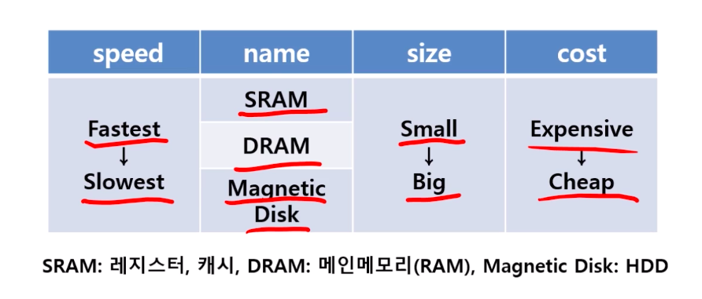
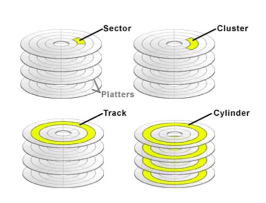

# 제 25강 메모리 계층구조 part1
## 1.1 메모리 계층구조
- 서로 다른 속도와 크기를 갖는 여러 계층의 메모리를 구성하는 방법 
- 빠른 -> 느린 순서의 계층적 구성 
  - 예) Register -> Cache -> RAM
- 메모리 계층구조로 구현함으로써 지역성의 원칙을 이용할 수 있음(주소공간 내의 비교적 작은 부분에만 접근하기 때문)

## 1.2 지역성 
- 시간적 지역성(temporal localty): 참조된 항목은 다시 참조될 가능성이 높다. 
  - 자료를 얻기위해 책을 여러번 참조한다.
- 공간적 지역성(spatial localty): 참조된 항목 주위의 데이터가 참조될 가능성이 높다. 
  - 특정한 자료를 찾을 때 최근에 접근했던 책과 같은 카테고리의 있는 책을 참조할 가능성이 높다. 

## 1.3 메모리 종류

## 1.4 SRAM & DRAM
- SRAM:
  - 읽고 쓰기 위한 포트가 하나있는 메모리 배열
  - 어떤 데이터든지 접근시간이 같다.
  - CPU에 집적되어있는 경우가 많다. 
- DRAM:
  - 한 종류로 정보를 구성하는 개개의 비트를 각기 분리된 축전기(Capacitor)에 저장하는 기억장치이다. 
  - 축전기에 전하를 누전하므로 무한한 저장불가
  - 주기적인 재생(refresh)과정이 필수적이다.
  - 재생과정은 단순히 저장된 값을 읽고 다시쓰는 과정   

## 1.5 Flash memory & Disk memory
- Flash:
  - 전기적으로 지울 수 있고, 프로그래밍 가능한 ROM의 한 종류
  - 전력이 중단되어도 정보를 유지하는 비휘발성 메모리
  - 사용처: SD카드, SSD

- Magnetic Disk:
  - 비휘발성 데이터 저장소로서 가격이 가장 싸기 때문에 보조 기억장치로 쓰임
  - 사용처: HDD

## 1.6 Disk memory 구조
- 각 디스크의 표면을 **트랙** 이라고함 
- 각 트랙은 **섹터** 로 나누어짐     
- 섹터의 집합을 **클러스터** 라고함
- 모든면의 한 점에 위치한 트랙을 **실린더** 라고함.
- 전자기 코일을 가지고 있는 헤드를 통해 데이터를 읽고쓴다. 

