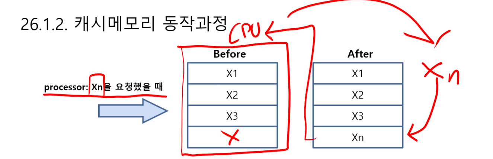

# 제 26강 메모리 계층구조 part2
## 1.1 캐시 메모리
- 메인 메모리와 프로세서 사이에 있는 메모리 계층을 나타내는 말
- SRAM으로 구성되어 있으며 속도가 굉장히 빠름
- 접근의 지역성을 이용하여 참조되었던 데이터를 저장
- 프로세서가 기억장치를 참조할 필요가 있을 경우 캐시를 가장 먼저 조사 

## 1.2 캐시메모리 동작과정

- 캐시기억장치를 검사하고 실패(miss)하면 주기억 장치로부터 정보를 획득하여 캐시 기억장치에 전송
- 캐시 기억장치는 정보를 다시 중앙처리장치로 전송

- 캐시 기억장치 검사, 적중(hit)
- 캐시 기억장치에서 얻어진 정보를 중앙처리장치로 전송

## 1.3 사상함수
- 주기억장치와 캐시메모리 사이에서 정보를 옮기는 방법
- 직접사상: 주소값을 활용하여 캐시메모리 블록의 특정라인에만 적재
- 연관사상: 캐시메모리의 아무 라인에나 적재가능
- 집합 연관사상: 직접사상과 연관사상 방식을 조합한 방식

## 1.4 직접사상

## 1.5 연관사상

## 2.1 메모리가 성능에 미치는 영향
- 컴퓨터의 시스템 메모리는 물리적인 메모리인 RAM과 가상메모리로 구성되어 있음
- 프로그램을 시작하면, 프로세서에서 하드 드라이브의 프로그램을 가져오라는 명령을 지시
- 파일을 가져오면 시스템에는 데이터를 조작하고 조작된 데이터와 상호 작용할 수 있는 작업영역이 필요함
- 즉, RAM이 커지면 컴퓨터가 빨라지는 것이 아니라 일정 용량 이상의 프로그램이 메모리에 적재되었을 때 메모리 용량이 클수록 수용량이 많아지기 때문에 더 좋은 성능을 보여줌 

## 2.2 운영체제 제한
