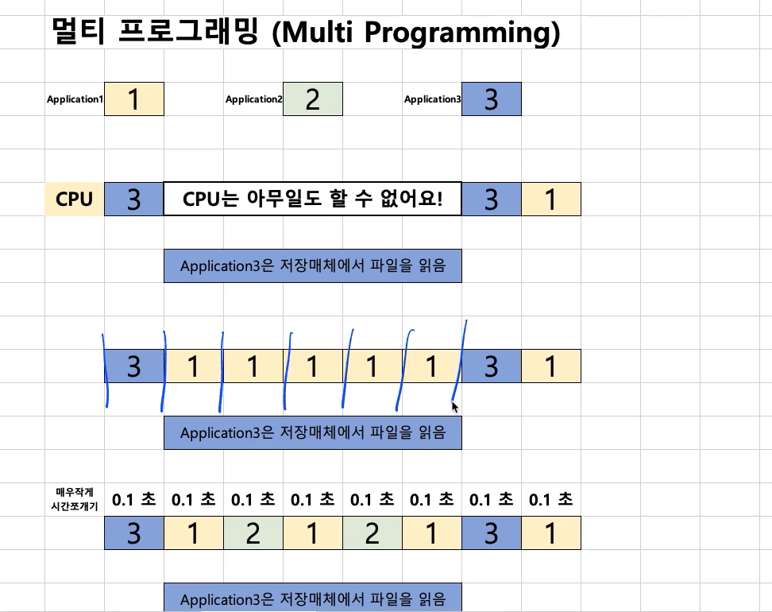

# 제 6강 운영체제 역사(1960년대 후반 - 멀티태스킹)
## 시분할 시스템과 멀티 태스킹 
- 멀티 태스킹: 단일 CPU에서, 여러 응용 프로그램의 병렬 실행을 가능케하는 시스템 
- 보통은 시분할 시스템 = 멀티 태스킹 
> 멀티 프로그래밍: 최대한 CPU를 많이 활용하도록 하는 시스템(시간대비 CPU 활용도를 높이자)

---
## 배치 처리 시스템의 단점 
- 컴퓨터 응답시간(response time)이 오래 걸릴 수 있다. (앞단에 실행시간이 많이 필요로하는 응용 프로그램이 실해오딜 경우)
- 실행 시간도 오래걸릴 수 있다.(CPU가 필요없음에도 응용 프로그램이 CPU를 점유할 수 있기 때문)

---
## 시분할 시스템과 배치 처리 시스템 
- 시분할 시스템/멀티 태스킹 
  - 핵심 기술: 시간을 잘게 쪼개서, 여러 응용 프로그램을 실행 
    - 컴퓨터 응답 시간을 줄일 수 있음(시분할 시스템, 다중 사용자를 지원)
    - 전체 응용 프로그램의 실행 시간도 줄일 수 있음(멀티 프로그래밍)
    - 결과적으로 사용자가 느낄 때에는 여러 응용 프로그램이 동시에 실행되는 것처럼 보인다.(멀티 태스킹) 
---
## 정리 
> 1960년대 후반부 정리 
- 시분할 시스템/멀티 태스킹 
  - 멀티 프로그래밍 
- 기술: CPU 시간을 잘게 쪼개기 
- 결과: 다중 사용자 지원, 응용 프로그램 동시 실행       