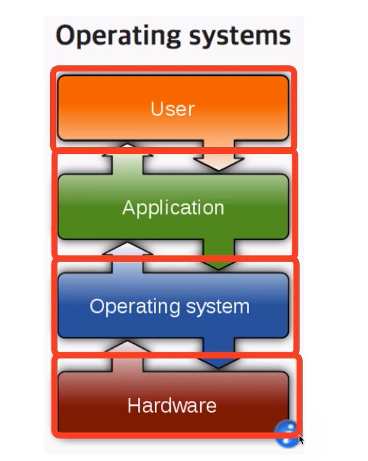
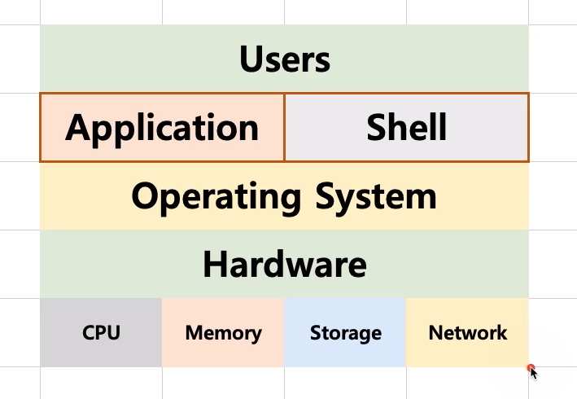

# 제 11강 운영체제 구조 - 시스템콜
## 응용 프로그램, 운영체제, 컴퓨터 하드웨어(시스템 리소스) 관계 
### 도서관으로 비유 
- 운영체제는 도서관 
- 응용 프로그램을 시민 
- 컴퓨터 하드웨어는 책 
- 운영체제의 역할 
  - 시민은 도서관에 원하는 책(자원)을 요청함
  - 도서관은 적절한 책(자원)을 찾아서, 시민에게 빌려줌 
  - 시민이 기한이 다 되면, 도서관이 해당 책(자원)을 회수함 
---
## 응용 프로그램, 운영체제, 컴퓨터 하드웨어 관계 
- 운영체제는 응용 프로그램이 요청하는 메모리를 허가하고, 분배한다. 
- 운영체제는 응용 프로그램이 요청하는 CPU시간을 제공하낟. 
- 운영체제는 응용 프로그래밍 요청하는 IO Devices 사용을 허가/제어한다. 
---
## 사용자, 응용 프로그램, 운영체제, 컴퓨터 하드웨어 관계 

---
## 운영체제는 사용자 인터페이스 제공 
- 쉘(Shell)
  - 사용자가 운영체제 기능과 서비스를 조작할 수 있도록 인터페이스를 제공하는 프로그램 
  - 쉘은 터미널 환경(CLI)과 GUI 환경 두 종류로 분류 

---
## 운영체제는 응용 프로그램을 위해서도 인터페이스를 제공 
- API(Application Programming Interface)
  - 함수로 제공 
  - open()
- 보통은 라이브러리(library) 형태로 제공 
  - C library   