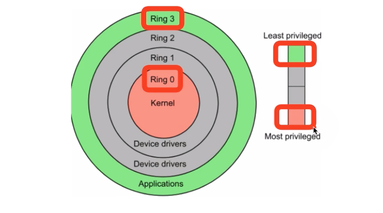
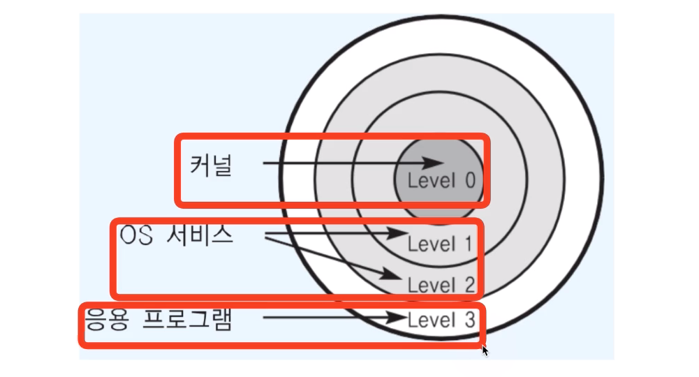
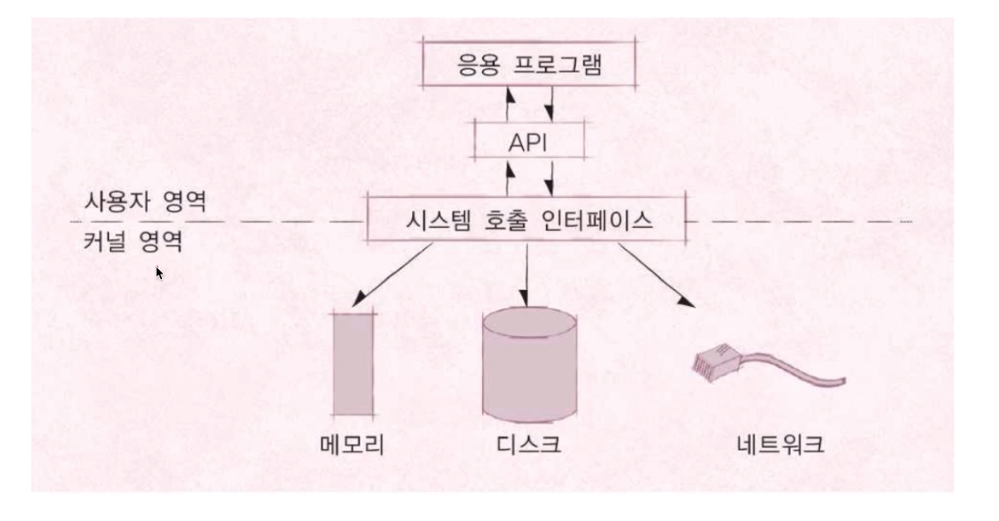
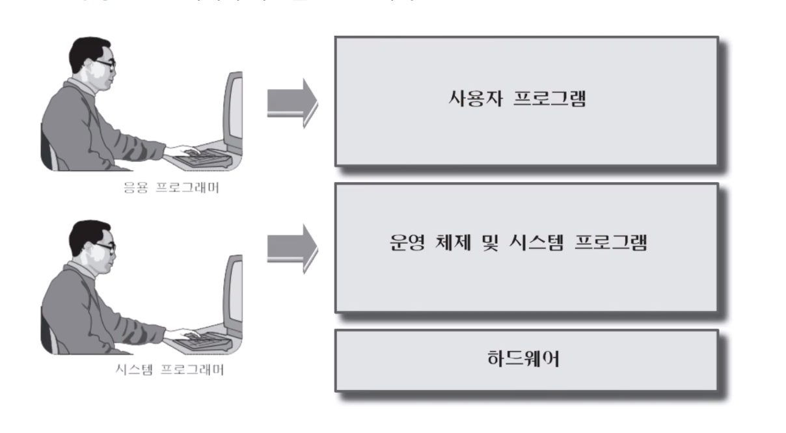
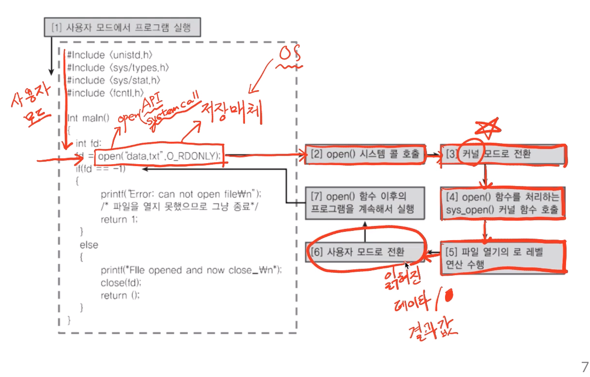
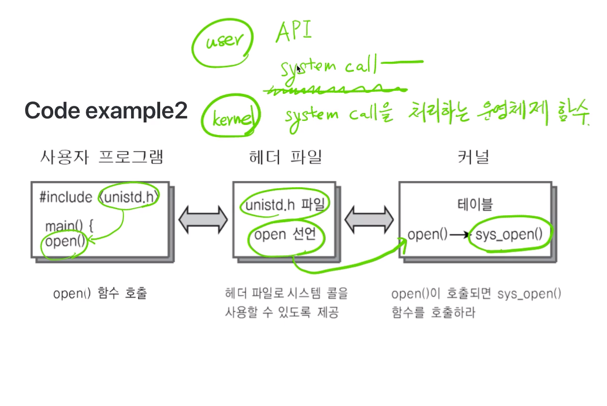

# 제 12강 운영체제 구조 - 사용자 모드와 커널 모드 
## CPU Protection Rings 
- CPU도 권한 모드라는 것을 가지고 있다. 
  - 사용자 모드(user mode by application)
  - 커널 모드(kernel mode by OS) : 특권 명령어 실행과 원하는 작업 수행을 위한 자원 접근을 가능케 하는 모드 

- Ring 3 : 사용자 모드 
- Ring 0 : 커널 모드 
---
## 쉬어가기 
> kernel 이란? OS kernel 
1. (견과류, 씨앗의) 알맹이 
2. (사상, 주제의) 핵심 
> shell이란? 
1. 껍데기 
2. 고둥 껍데기 모양의 것 
---
## CPU Protection Rings 
### 두 가지 모드 
- 사용자 모드 (user mode): 응용 프로그램이 사용 
- 커널 모드 (kernel mode): OS가 사용 

---
## 응용 프로그램과 운영체제 
- 우리가 만드는 프로그램은 맨 위에서 놀고 있다! 

---
## 시스템 콜은 커널 모드로 실행 
- 커널 모드에서만 실행 가능한 기능들이 있음 
- 커널 모드로 실행하려면, 반드시 시스템 콜을 사용해야함(거쳐야함)
  - 커널 모드로 CPU 실행 
  - 사용자 모드에서는 CPU를 실행할 수 없음 
- 시스템 콜은 운영체제 제공 

---
## 사용자 모드와 커널 모드 
- 함부로 응용 프로그램이 전체 컴퓨터 시스템을 해치지 못함 
- 주민등록등본은 꼭 동사무소 또는 민원24시에서 특별한 신청서를 써야만 발급이 가능한 것과 같은 원리 : (사용자 모드)
- 동사무소 직원분들은 특별한 권한을 가지고, 주민등록등본 출력 명령을 실행 : (커널모드)
---
## 쉬어가기 
- 응용 프로그래머와 시스템 프로그래머 

---
## Code Example 1

---
## Code example 2

---
## 정리 
- 운영체제는 **시스템 콜** 제공 
- 프로그래밍 언어별로 운영체제 기능을 활용하기 위해, 시스템 콜을 기반으로 **API**를 제공 
- 응용 프로그램은 운영체제 기능 필요시, 해당 **API**를 사용해서 프로그램을 작성함 
- 응용 프로그램이 실행돼서, 해당 운영체제 기능이 필요한 **API**를 호출하면, 시스템 콜이 호출되서, <u>커널 모드로 변경되어</u> OS 내부에서 해당 명령이 실행되고, 다시 응용 프로그램으로 돌아간다. 