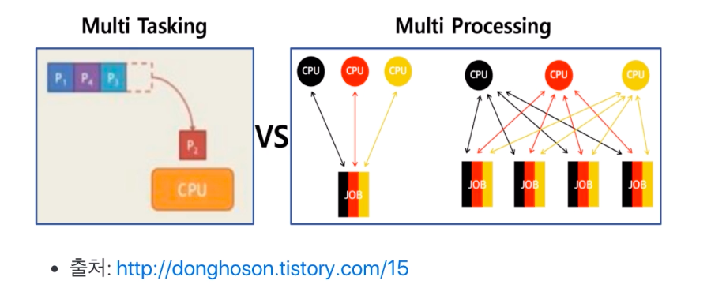

# 제 13강 스케쥴링 - 배치 처리, 멀티 태스킹, 멀티 프로세싱 상세
## 배치 처리 시스템 
- Queue와 같은 방식으로 동작 (First In First Out)

---
## 배치 처리 시스템과 시분할 시스템/멀티 프로그래밍 
- 배치 처리 시스템 : 여러 프로그램을 순차적으로 실행시킬 수 있도록 해주세요!
  - 어떤 프로그램은 실행이 너무 시간이 많이 걸려서, 다른 프로그램이 실행하는데 시간을 많이 기다려야 한다. 
  - 나는 MP3 음악을 들으면서, 문서 작성을 하고 싶어요.(동시에 여러 응용 프로그램 실행) 
  - 여러 사용자가 동시에 하나의 컴퓨터를 쓰려면 어떻게 해야 하나요?(다중 사용자 지원)
> 멀티 프로그래밍/ 시분할 시스템이 나온 계기가 됨 
---
## 시분할 시스템 
- 시분할 시스템: 다중 사용자 지원을 위해 컴퓨터 응답시간을 최소화하는 시스템 
---
## 멀티 태스킹
- 멀티 태스킹: 단일 CPU에서 여러 응용프로그램이 동시에 실행되는 것처럼 보이도록 하는 시스템 
---
## 실제 멀티 태스킹 
- 1000 밀리초(ms) = 1초 
- 10 ~ 20 ms 단위로도 실행 응용 프로그램이 바뀌더라 
- 사용자에게는 동시에 실행되는 것처럼 보임 

---
## 멀티 태스킹과 멀티 프로세싱 
- 멀티 태스킹과 멀티 프로세싱

   

- 멀티 태스킹: 단일 CPU 
- 멀티 프로세싱: 여러 CPU에서 하나의 프로그램을 병렬로 실행해서 실행속도를 극대화시키는 시스템 
---
## 정리 
- 배치 처리 시스템 
- 시분할 시스템 (다중 사용자 지원, 응답시간 최소화)
- 멀티 태스킹 (동시 실행하는 것처럼 보이도록)
- 멀티 프로세싱 (여러 CPU에 하나의 프로그램을 병렬로 실행시키는 시스템)