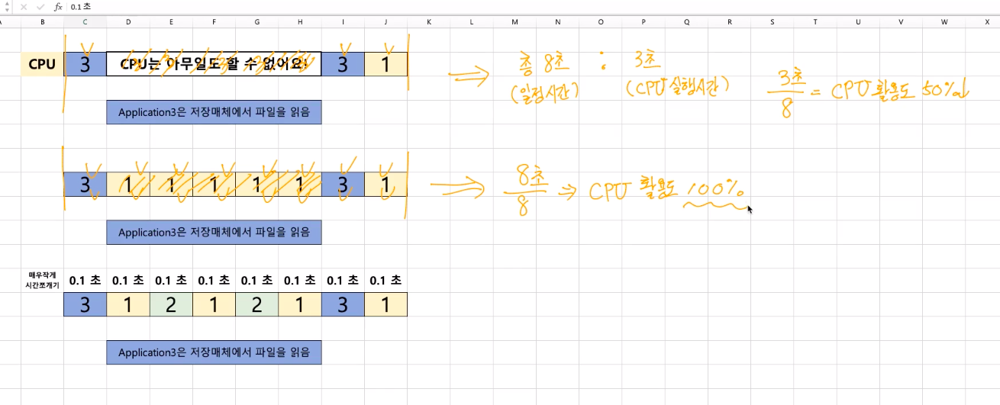
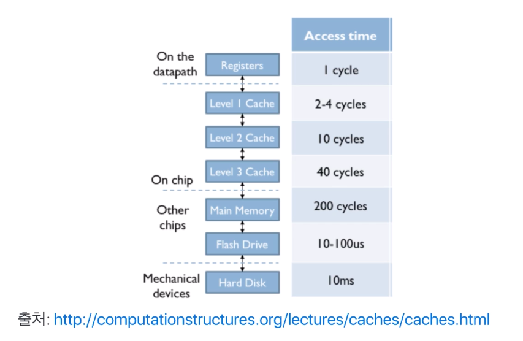
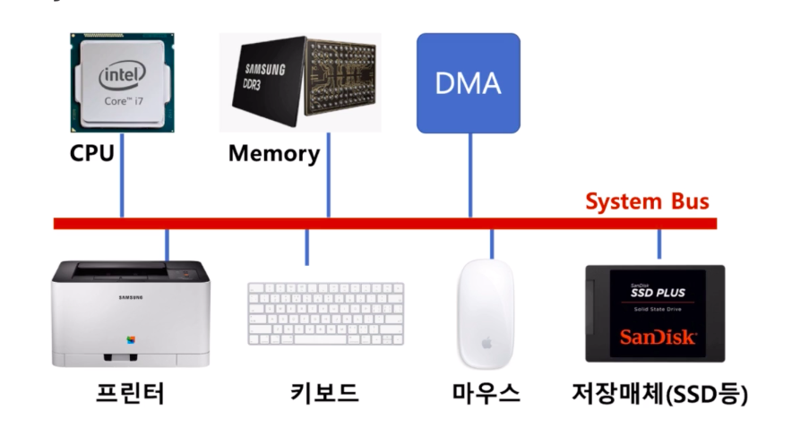

# 제 14강 스케쥴링 - 멀티 프로그래밍 
## 프로세스 스케줄링 
### 멀티 프로그래밍 
- 최대한 CPU를 많이 활용하도록 하는 시스템 
  - 시간 대비 CPU 활용도를 높이자 
  - 응용 프로그램을 짧은 시간 안에 실행완료를 시킬 수 있음 

---
## 멀티 프로그래밍 
- 응용 프로그램은 온전히 CPU를 쓰기보다, 다른 작업을 중간에 필요로 하는 경우가 많습니다. 
  - 응용 프로그램이 실행되다가 파일을 읽는다. 
  - 응용 프로그램이 실행되다가 프린팅을 한다. 

    

---
## 메모리 계층 - 컴퓨터 구조 복습 
  

---
## System Bus - 컴퓨터 구조 복습 
    
- CPU는 디스크나 메모리에 직접 접근하지 않고 DMA에 맡긴다. 
  - 최신 컴퓨터 시스템/운영체제에서는 CPU가 모든 처리를 관장하면, 아까우니까, 디스크, 메모리등등은 DMA등과 같은 별도 칩이 다루고, CPU는 코드 실행에 집중토록 해서, 효율을 높였다

---
## 정리 
> 실제로는 시분할 시스템, 멀티 프로그래밍, 멀티 태스킹이 유사한 의미로 통용된다. 
- 핵심 
  - 여러 응용 프로그램 실행을 가능토록 함 
  - 응용 프로그램이 동시에 실행되는 것처럼 보이도록 함 
  - CPU를 쉬지 않고 응용 프로그램을 실행토록 해서 짧은 시간 안에 응용 프로그램이 실행완료될 수 있도록 함 
  - 컴퓨터 응답시간을 짧게해서 다중사용자도 지원  
---
## 정리 
- 시분할 시스템: 다중 사용자 지원, 컴퓨터 응답시간을 최소화하는 시스템 
- 멀티 태스킹: 단일 CPU에서 여러 응용 프로그램을 동시에 실행시키는 것처럼 보임 
- 멀티 프로세싱: 여러 CPU에서 하나의 응용 프로그램을 병렬로 실행해서, 실행속도를 높이는 기법 
- 멀티 프로그래밍: 최대한 CPU를 일정시간당 많이 활용하는 시스템 

