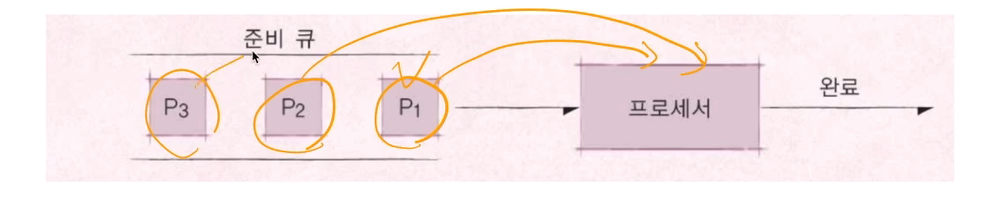

# 제 15-1강 스케쥴링 알고리즘 기본1 
## 프로세스(process)란? 
- 실행 중인 프로그램은 프로세스라고 함 
  - 프로세스: 메모리에 올려져서 실행 중인 프로그램 
  - 코드 이미지(바이너리): 실행 파일, 예: ELF format 
> 프로세스라는 용어는 작업, task, job이라는 용어와 혼용  
---
## 여기서 잠깐 
- 응용 프로그램 != 프로세스 
  - 응용 프로그램은 여러 개의 프로세스로 이루어질 수 있음 
- 하나의 응용 프로그램은 여러 개의 프로세스(프로그램)가 상호작용을 하면서 실행될 수도 있음    
> 간단한 C/C++ 프로그램을 만든다면 -> 하나의 프로세스 
> 여러 프로그램을 만들어서 서로 통신하면서 프로그램을 작성할 수도 있음(IPC 기법)

---
## 스케줄러와 프로세스 
> 누가 프로세스 실행을 관리하는가 -> 스케줄러 
 --- 
 ## 스케줄링 알고리즘 
 > 어느 순서대로 프로세스를 실행시킬까 
- 목표 
  - 시분할 시스템 예: 프로세스 응답 시간을 가능한 짧게 
  - 멀티 프로그래밍 예: CPU 활용도를 최대로 높혀서 프로세스를 빨리 실행 
   
---
## FIFO 스케줄러 
> 프로세스가 저장매체를 읽는 다든지, 프린팅을 한다든지 하는 작업 없이 쭉 CPU를 처음부터 끝까지 사용한다. 
- 가장 간단한 스케줄러(배치 처리 시스템)
- FCFS(Fisrt Come First Served) 시스템 

    
---
## 최단 작업 우선(SJF) 스케줄러 
- SJF(Shortest Job First) 스케줄러 
  - 가장 프로세스 실행시간이 짧은 프로세스부터 먼저 실행을 시키는 알고리즘
  - 응답시간은 빨라보이지만 실행시간을 다 알아야하는 단점이 있음 