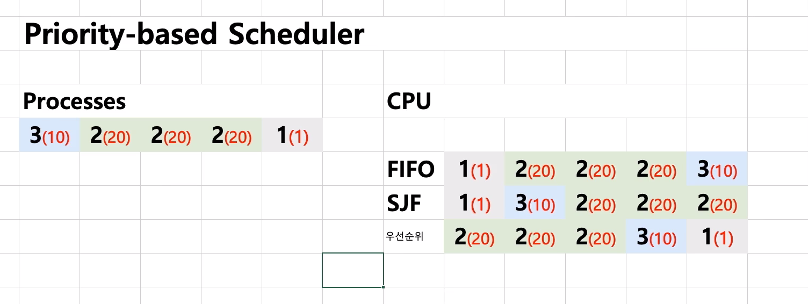
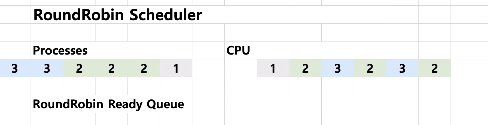

# 제 15-2강 스케쥴링 알고리즘 기본2 
## 여기서 잠깐! 
- RealTime OS(RTOS): 응용 프로그램 실시간 성능 보장을 목표로 하는 OS 
  - 정확하게 프로그램 시작, 완료 시간을 보장 
  - 시간에 민감한 프로세스를 돌려야되는 환경에서 사용 
  - Hardware RTOS, Software RTOS

- General Purpose OS(GPOS): 프로세스 실행시간에 민감하지 않고, 일반적인 목적으로 사용되는 OS 
  - 예: Windows, Linux 등 

---
## 우선순위 기반 스케줄러 
- Priority-Based 스케줄러 
  - 정적 우선순위 
    - 프로세스마다 우선순위를 미리 지정 
  - 동적 우선순위 
    - 스케줄러가 상황에 따라 우선순위를 동적으로 변경 

        

---
## Round Robin 스케줄러 
- 정해진 시간이 지나면 다음 프로세스로 넘김
  - 아래의 예는 1초가 정해진 시간이라치면 1초 뒤에 다음 프로세스로 넘어간다 

   

---
## 정리 
- 다양한 기본 스케줄링 알고리즘 
  - FIFO (FCFS) 스케줄링 알고리즘(배치 처리 시스템)
  - 최단 작업 우선(SJF) 스케줄링 알고리즘 
  - 우선순위 기반 스케줄링 알고리즘 
    - 정적 우선순위, 동적 우선순위 
  - Round Robin 스케줄링 알고리즘 
    - 시분할 시스템 기반   