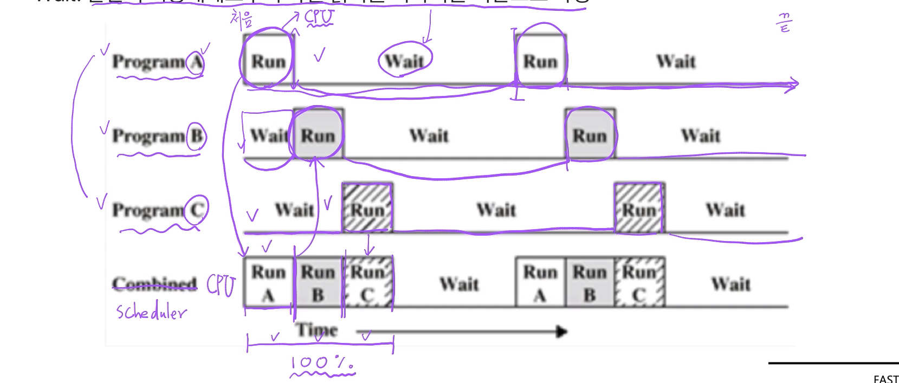

# 제 16강 프로세스 상태와 스케쥴러
## 멀티 프로그래밍과 Wait
- 멀티 프로그래밍: CPU 활용도를 극대화하는 스케줄링 알고리즘 
- Wait: 간단히 저장매체로부터 파일 읽기를 기다리는 시간으로 지정 

---
## 프로세스 상태 

- running state: 현재 CPU에서 실행 상태 
- ready state: CPU에서 실행 가능 상태(실행 대기 상태)
- block state: 특정 이벤트 발생 대기 상태(예: 프린팅이 다 되었다!)
  - 앞에서 본 Wait와 유사한 의미 
  - 저장매체(파일 읽기)

