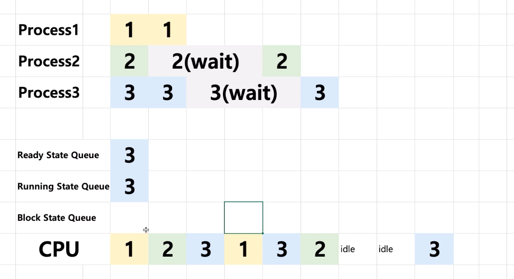
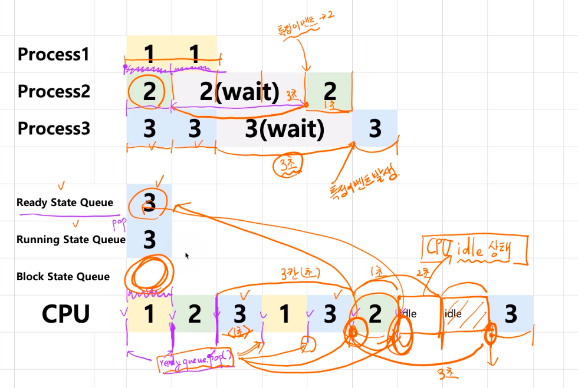

# 제 17강 프로세스 상태기반 스케쥴링 알고리즘 기본
##
- Ready State Queue: 프로세스를 실행할 준비가 된 프로그램들이 대기 중 
- Running State Queue: CPU에서 실행하고 있는 프로그램들 
- Block State Queue: 데이터를 읽고 있는 중인 프로그램들(Wait)
- idle 상태: CPU에서 아무것도 하지 않는 상태(예를 들어, Wait로 인해 실행중인 프로그램이 없거나, 실행하려는 프로그램이 없음)

