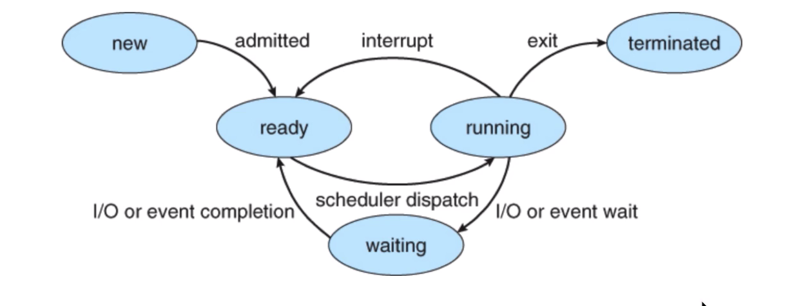
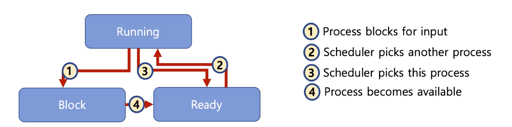
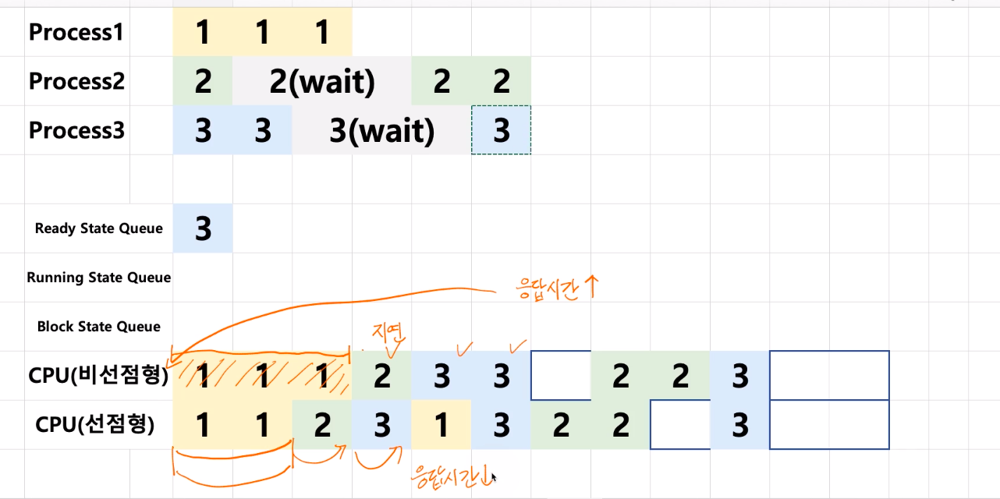

# 제 18강 선점형과 비선점형 스케쥴러
## 선점형과 비선점형 스케줄러 
- 선점형 스케줄러(Preemptive Scheduling)
  - 하나의 프로세스가 다른 프로세스 대신에 프로세서(CPU)를 차지할 수 있음 
- 비선점형 스케줄러(Non-preemptive Scheduling)
  - 하나의 프로세스가 끝나지 않으면 다른 프로세스는 CPU를 사용할 수 없음  

---
## 선점형과 비선점형 스케줄러 차이 
- 비선점형: 프로세스가 자발적으로 blocking 상태로 들어가거나, 실행이 끝났을 때만, 다른 프로세스로 교체 가능 

- 선점형: 프로세스 running 중에 스케줄러가 이를 중단시키고, 다른 프로세스로 교체 가능

### 선점형과 비선점형 스케줄러 비교 

