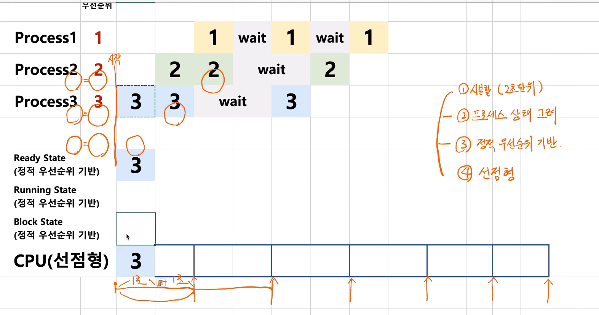
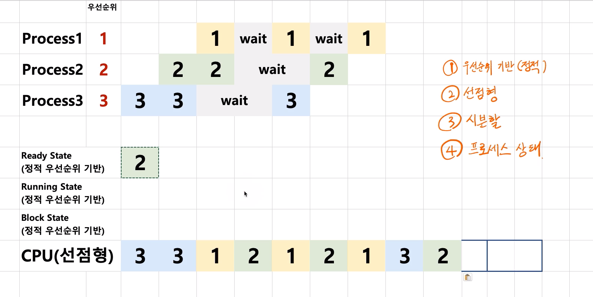

# 제 19강 스케쥴링 알고리즘 조합 
## 선점형과 비선점형 스케줄러 
### 스케줄러 구분 (정책, policy)
- FIFO(FCFS), SJF, Priority-based는 어떤 프로세스를 먼저 실행시킬지에 대한 알고리즘 (비선점형 스케줄러)
- RoundRobin은 시분할 시스템을 위한 기본 알고리즘(선점형 스케줄러)

- state는 큐가 아니라 우선순위 기반이다. 

- 응답시간을 빠르게 할 수 있음 

---
## 가볍게 듣기 
### 랙? : 마우스/키보드 반응이 느린 경우? 
> 스케줄러가 해결해야하는 이슈! 
> 다양하고 복잡한 스케줄링 알고리즘 필요 
- 리눅스 스케줄러: O(1), CFS와 같이 다양한 방식으로 변경시도 중 
  - 인터렉티브, IO, CPU 중심 프로세스로 미리 구분할 수 있다면 보다 개선된 스케줄링 가능함 
  - 프로세스 수가 많아지면 반응속도가 느려질 것이다 