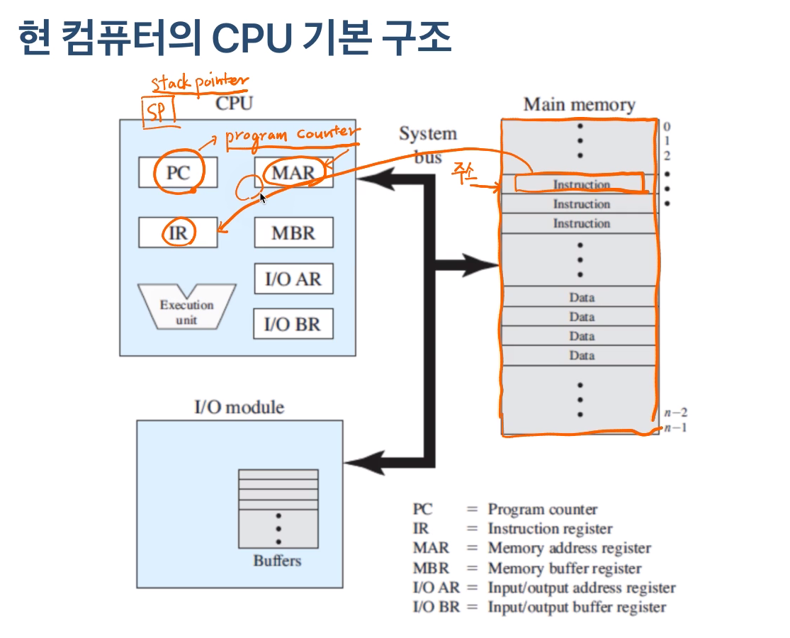
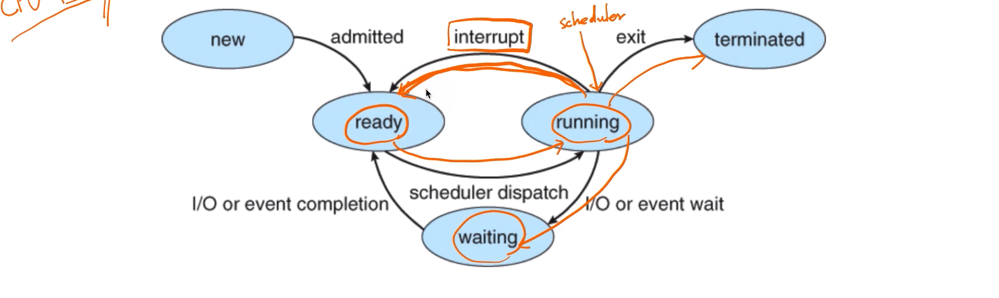
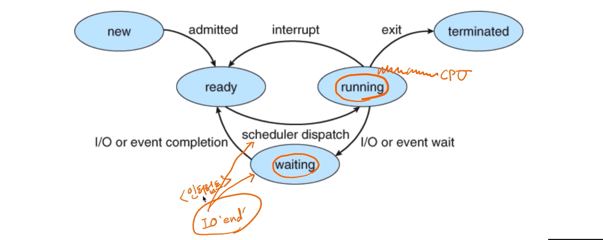

# 제 20강 인터럽트란
## 스케줄링 알고리즘에서 인터럽트 
## 인터럽트란? 

> 어느 한 순간 CPU가 실행하는 명령은 하나!뿐이다. 다른 장치와 어떻게 커뮤니케이션을 할까요? 
- 인터럽트 : CPU가 프로그램을 실행하고 있을 때, 입출력 하드웨어 등의 장치(나 또는 예외상황이 발생하여 처리가 필요한 경우에 CPU에 알려서 처리하는 기술 
  - 입출력 하드웨어 같은 곳에서 이벤트가 발생하면 CPU가 알아야 하는데 이를 알리고 처리하는 걸 인터럽트라고 함. 

---
## 인터럽트가 필요한 이유 
- 선점형 스케줄러 구현 
  - 프로세서 running 중에 스케줄러가 이를 중단시키고, 다른 프로세스로 교체하기 위해 현재 프로세스 실행을 중단시킴    - 그러려면, 스케줄러 코드가 실행이 되서 현 프로세스 실행을 중지시켜야함 

- IO Device와의 커뮤니케이션 
  - 저장매체에서 데이터 처리 완료시, 프로세스를 깨워야함(block state -> ready state)

- 예외상황 핸들링 
  - CPU가 프로그램을 실행하고 있을 때, 입출력 하드웨어 등의 장치나 또는 예외상황이 발생할 경우, CPU가 해당 처리를 할 수 있도록 CPU에 알려줘야함 

- 인터럽트는 일종의 이벤트. 정의되어 있고, 발생할 수 있고... 이에 따른 적절한 처리가 필요. 이런 부분이 대부분 운영체제 안에서 처리 됨. 사실 이벤트에 대해 정의하고 처리하는게 운영체제    

