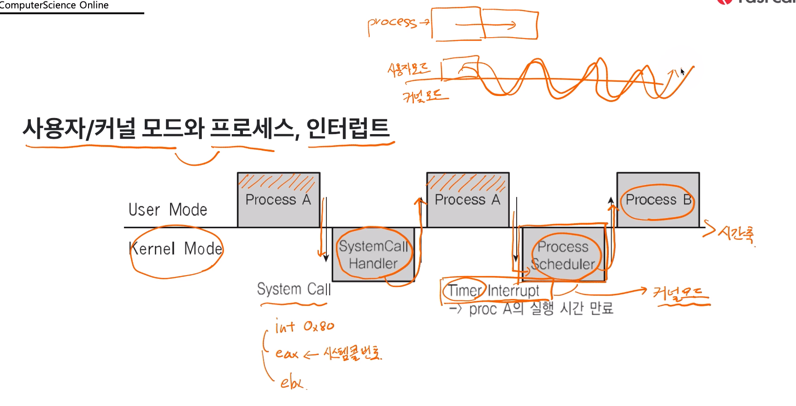
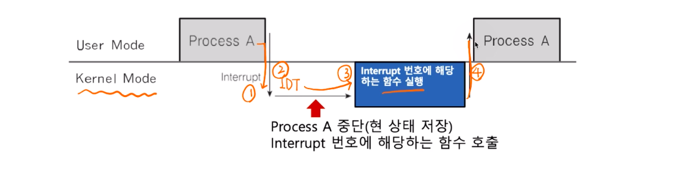
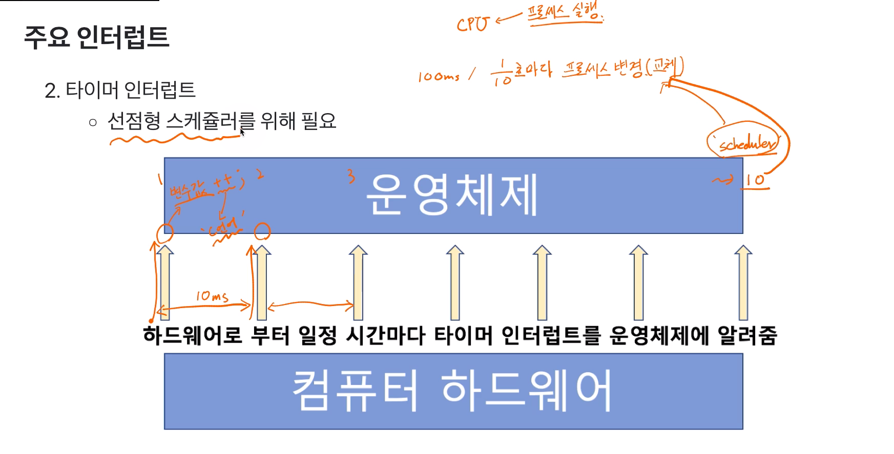

# 제 22강 인터럽트 내부 동작 
## 시스템 콜 인터럽트 
- 시스템 콜 실행을 위해서는 강제로 코드에 인터럽트 명령을 넣어, CPU에게 실행시켜야 한다. 
- 시스템 콜 실제코드 
  - eax 레지스터에 시스템 콜 번호를 넣고, 
  - ebx 레지스터에는 시스템 콜에 해당하는 인자값을 넣고, 
  - 소프트웨어 인터럽트 명령을 호출하면서 0x80값을 넘겨줌 

  ```
  mov eax, 1 // eax에 시스템 콜 번호 넣음 
  mov ebx, 0 // ebx는 인자 
  int 0x80 // 소프트웨어 인터럽트 명령 
  // 위의 int는 CPU의 op code, 0x80은 인터럽트의 번호(시스템콜의 인터럽트 번호가 0x80)
  ```

  ---
  ## 인터럽트와 시스템 콜(고급)
  - 시스템콜 인터럽트 명령을 호출하면서 0x80값을 넘겨줌 
    - CPU는 사용자 모드를 커널 모드로 바꿔줌 
    - IDT(Interrupt Descriptor Table - 인터럽트 번호와 주소코드가 적혀있는 테이블)에서 0x80에 해당하는 주소(함수)를 찾아서 실행함 
    - system_call() 함수에서 eax로부터 시스템콜 번호를 찾아서 해당 번호에 맞는 시스템콜 함수로 이동 
    - 해당 시스템콜 함수 실행 후, 다시 커널 모드에서 사용자 모드로 변경하고, 다시 해당 프로세스 다음 코드 진행 


| %eax | kernel function(system call) | %ebx |
|:--:|:--:|:--:|
| 1 | sys_exit(exit) | int |
| 2 | sys_fork(fork) | struct pt_regs |
| 3 | sys_read(read) | unsigned int |
| 4 | sys_write(write) | unsigned int |
| 5 | sys_open(open) | const char* |

---
## 사용자/커널 모드와 프로세스, 인터럽트 
- Process Scheduler에서 Timer Interrupt가 자주 쓰임 


---
## 인터럽트와 IDT 
- 인터럽트는 미리 정의되어 각각 번호와 실행 코드를 가리키는 주소가 기록되어 있음 
  - 어디에? IDT(Interrupt Descriptor Table - 이벤트 번호: 실행코드의 주소(함수))에 기록 
  - 언제? 컴퓨터 부팅시 운영체제가 기록 
  - 어떤 코드? 운영체제 내부 코드(커널모드/커널영역) 

- 다시 예를 보면,
  - 항상 인터럽트 발생 시, IDT를 확인 
  - 시스템콜 인터럽트 명령은 0x80 번호가 미리 정의 
  - 인터럽트 0x80에 해당하는 운영체제 코드는 system_call()이라는 함수 
  - 즉, IDT에는 0x80 -> system_call()와 같은 정보가 기록되어 있음 

- 리눅스의 예 
  - 0 ~ 31: 예외상황(내부/소프트웨어 인터럽트) 인터럽트(일부는 정의 안된채로 남겨져 있음)
  - 32 ~ 47: 하드웨어 인터럽트(주변장치 종류/갯수에 따라 변경 가능) 
  - 128: 시스템콜    

---
## 인터럽트와 프로세스 
1. 프로세스 실행 중 인터럽트 발생 
2. 현 프로세스 실행 중단 
3. 인터럽트 처리 함수 실행(운영체제)
4. 현 프로세스 재실행 

  

> 선점형 스케줄러 구현 예 
- 수시로 타이머 인터럽트 발생 
  - 운영체제가 타이머 인터럽트 발생 횟수를 기억해서 5번 타이머 인터럽트 발생하면 현재 프로세스를 다른 프로세스로 바꿔준다. 

  
  