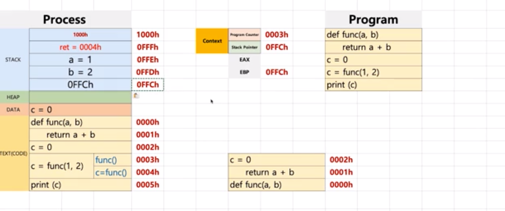

# 제 24강 프로세스 구조와 컴퓨터 구조 
## 프로세스와 컨텍스트 스위칭 
- 프로세스(process)는 일반적으로 어떻게 구성되어 있을까? 
  - text(CODE): 코드 
  - data: 변수/초기화된 데이터 
  - stack: 임시 데이터(함수 호출, 로컬 변수 등)
  - heap: 코드에서 동적으로 만들어지는 데이터 

- PC(Program Counter) + SP(Stack Pointer)

---
## 여기서 잠깐 복습 
- 스택(stack)

---
- 항상 stack에 return address를 가지고 있다. 
- EBP는 스택 실행 할 address를 저장하는데 특정 스택의 함수에서 문제가 생기면 빠르게 오류를 추적할 수 있다.(기준점)
- EAX에 return 값이 저장된다 
- 함수가 끝나면 스택에 있는 인자 값들은 사라진다. 

