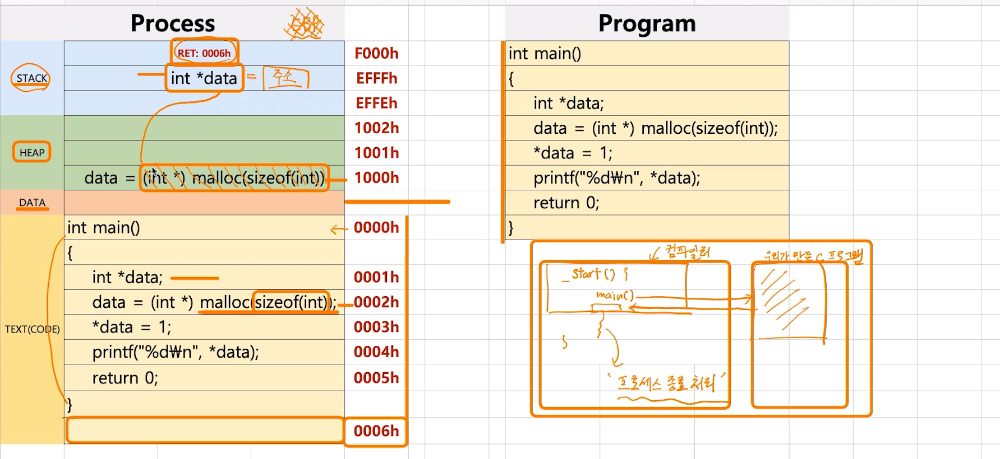
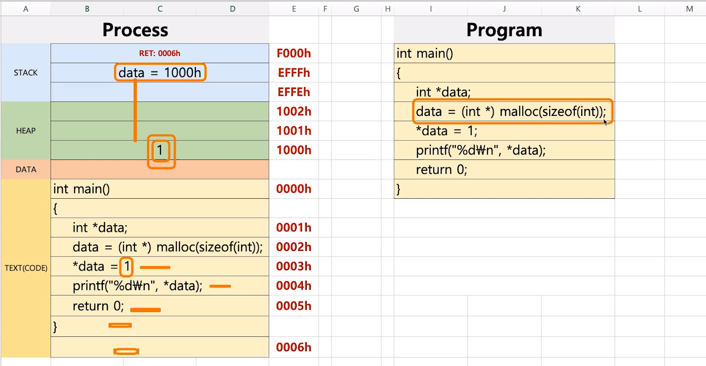

# 제 25강 프로세스 구조와 힙 
## Heap 이란? 
```c
#include <stdio.h>
#include <stdlib.h>

int main()
{
    int *data;
    // data의 메모리가 heap에 저장됨
    data = (int *) malloc(sizeof(int));
    *data = 1;
    printf("%d\n", *data);

    return 0;
}
```

- malloc : 동적으로 메모리를 생성하는 함수
  - 인자가 size로 들어감 
  - 주소를 리턴함  

- data 영역은 동적으로 생성되는 영역 아니고 컴파일단에서 코드를 보고 만들어지는 미리 선언된 전역변수들이 들어감   



- 힙 영역에는 실제 메모리가 들어가고 스택에는 그 메모리를 가르키는 메모리 주소값이 들어간다 

---



- 힙 공간에 있는 변수에 값이 할당되면 힙에 값이 들어간다 

