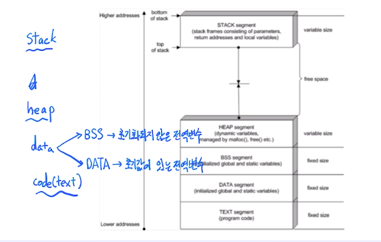
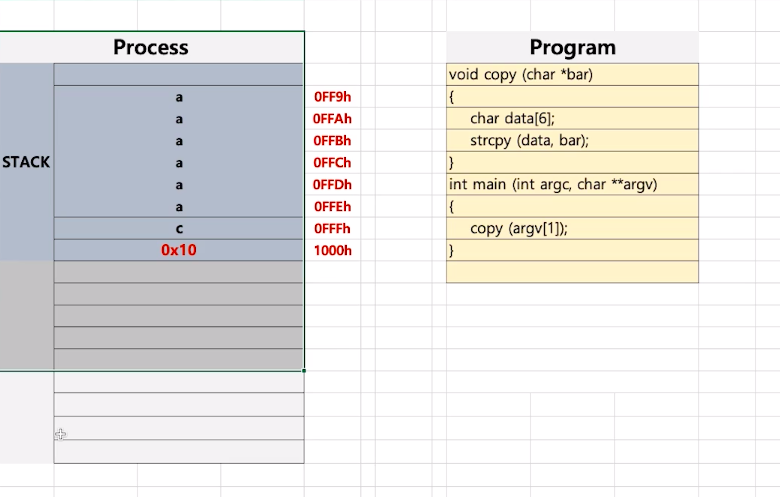

# 제 26강 프로세스 구조와 스택 오버플로우 
## 프로세스 구조: Stack, Heap, Data(BSS, DATA), TEXT(CODE)

> DATA를 BSS와 DATA로 분리 
- data
  - BSS : 초기화되지 않은 전역변수 
  - DATA : 초기화 값이 있는 전역변수 

  

---
## 가볍게 듣기 
- 스택 오버플로우: 주로 해커들의 공격에 활용되었음 
  - 예상하지 않은 해커가 임의로 집어넣은 메모리의 데이터를 불러옴

  