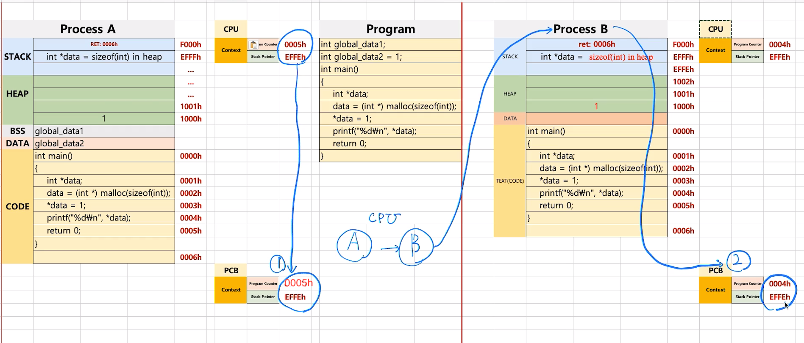
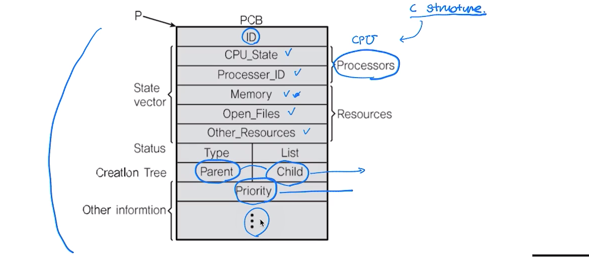

# 제 27강 컨텍스트 스위칭 원리 
## 프로세스와 컨텍스트 스위칭 
> 다시 PC, SP에 주목하자. 
- PC(Program Counter) + SP(Stack Pointer)
> Stack, HEAP, DATA(BSS, DATA), TEXT(CODE)
 
바꿀 프로세스의 PC, SP를 PCB에 넣어둔다. 

---
## PCB
> PC, SP는 어디에 저장하나? 
 
## Process Control Block(PCB)에 저장 
> Process Context Block이라고도 함 
1. Process ID
2. Register 값(PC, SP 등)
3. Scheduling Info(Process State) - ready, block, running
4. Memory Info(메모리 사이즈 limit)

> PCB: 프로세스가 실행중인 상태를 캡처/구조화해서 저장 

---
## PCB: 리눅스 예 
1. Process ID 
2. Register(PC, SP 등)
3. Scheduling Info(Process State)
4. Memory Info(메모리 사이즈 limit)
 
 

---
## 정리 
- 프로세스 구조 
  - Stack, HEAP, DATA(BSS, DATA), TEXT(CODE)

- PCB 
  - 프로세스 상태 정보 - PC, SP, 메모리, 스케줄링 정보(컨텍스트 스위칭) 등 