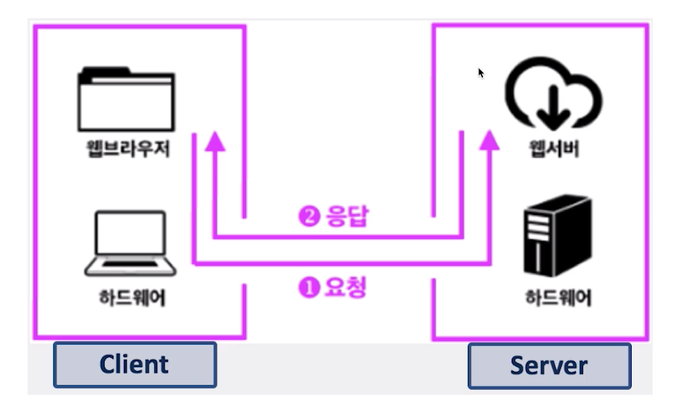

# 제 29강 프로세스간 커뮤니케이션(InterProcess Communication - IPC)

> 프로세스들이 서로의 공간을 쉽게 접근할 수 있다면? 프로세스 데이터/코드가 바뀔 수 있으니 얼마나 위험하겠는가.

- 프로세스는 다른 프로세스의 공간을 접근할 수 없다. 

---
## IPC(InterProcess Communication)

> 프로세스간에 커뮤니케이션을 해야한다면 어떻게 해야할까? 
- 프로세스간 통신 방법을 제공함 
- IPC: InterProcess Communication

---
## 프로세스간 통신이 필요한가요? 
- 성능을 높이기 위해 여러 프로세스를 만들어서 동시 실행 
- 이 때 프로세스간 상태 확인 및 데이터 송수신이 필요 

---
## 가볍게 생각해보기 
- fork() 시스템콜 
  - fork() 함수로 프로세스 자신을 복사해서 새로운 프로세스로 만들 수 있음 
    - 부모 프로세스, 자식 프로세스 

- 프로세스를 fork() 해서, 여러 프로세스를 동시에 실행시킬 수 있음 
> CPU가 한 개일때만 생각하지만, 최근에는 CPU 안에 코어가 8개가 되는 경우도 많고, 각 프로세스를 각 코어에 동시 실행 가능(병렬 처리) 

- 여러 프로세스 동시 실행하기 예 
- 1 ~ 10000까지 더하기 
  - fork() 함수로 10개 프로세스 만들어서, 각각 1 ~ 1000, 1001 ~ 2000, ... 더하기 
  - 각각 더한 값을 모두 합하면, 더 빠르게 동작 가능 

> 단, 이 때 각 프로세스가 더한 값을 수집해야 하므로, 프로세스간 통신 필요   

- 웹 서버 예시 
- 클라이언트와 서버 
  - 웹 서버란? 요청이 오면, HTML 파일을 클라이언트에 제공하는 프로그램 
  - 새로운 사용자 요청이 올 때마다, fork() 함수로 새로운 프로세스 만들고, 각 사용자 요청에 즉시 대응 

> CPU 병렬 처리가 가능하다면, 더 빠른 대응이 가능 
> 단, 이 때 각 프로세스 제어 및 상태 정보 교환을 위해 프로세스간 통신 필요  

---
## 프로세스간 커뮤니케이션 
- file을 사용하면, 실시간으로 직접 원하는 프로세스에 데이터 전달이 어려움 
  - 왜? 해당 프로세스가 파일을 읽어야 하는데... 계속 실시간으로 읽고만 있을 수는 없으니..
  - 사용자에서 커널 모드 가고 저장 매체로 갔다와야 하고 등등 오래 걸림 

> 그래서 보다 다양한 IPC 기법이 있음   