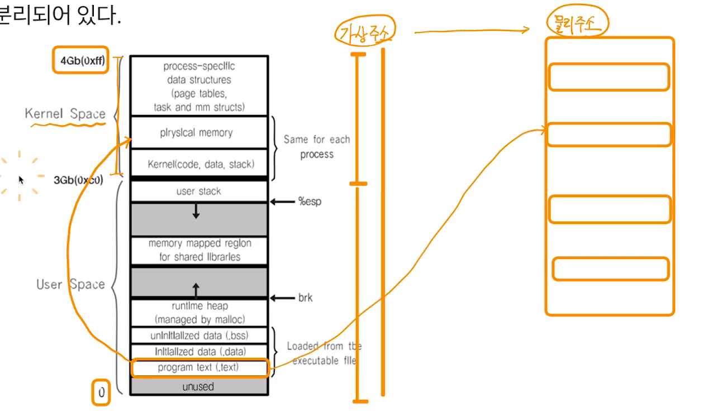
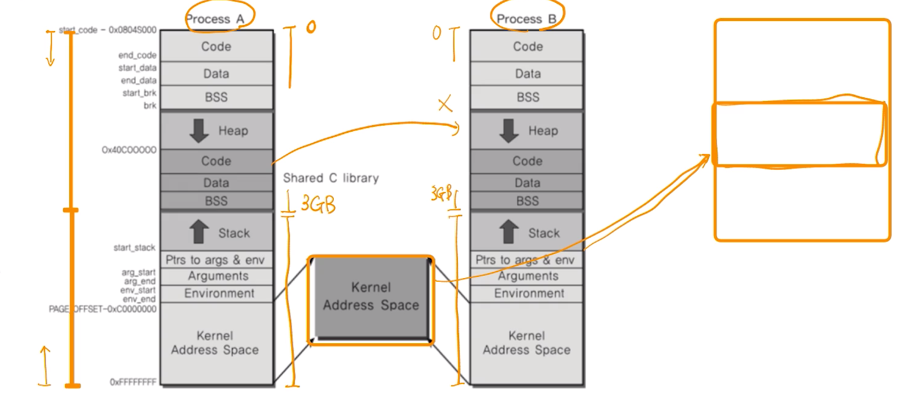

# 제 30강 프로세스와 IPC 
## 실제 프로세스: 리눅스 예 
- 프로세스간 공간은 완전히 분리되어 있다. 

> 사용자 모드에서는 커널 공간 접근 불가 

---
- 커널 공간은 공유한다. 

> 보다 구체적인 내용은 가상 메모리에서 다룸 

---
## 다양한 IPC 기법 
- IPC: InterProcess Communication
1. file 사용 (실시간성 떨어짐, 저장매체 직접 접근해 성능 떨어짐)
2. Message Queue
3. Shared Memory
4. Pipe
5. Signal 
6. Semaphore
7. Socket
...

> 2번부터는 모두 커널 공간을 사용하는 것임 - 이것이 핵심 

---
## 정리 
- 여러 프로세스 동시 실행을 통한 성능 개선, 복잡한 프로그램을 위해 프로세스간 통신 필요 
- 프로세스간 공간이 완전 분리 
- 프로세스간 통신을 위한 특별한 기법 필요 
  - IPC(InterProcess Communication)
- 대부분의 IPC 기법은 결국 커널 공간을 활용하는 것임 
  - 이유: 커널 공간은 공유하기 때문   
