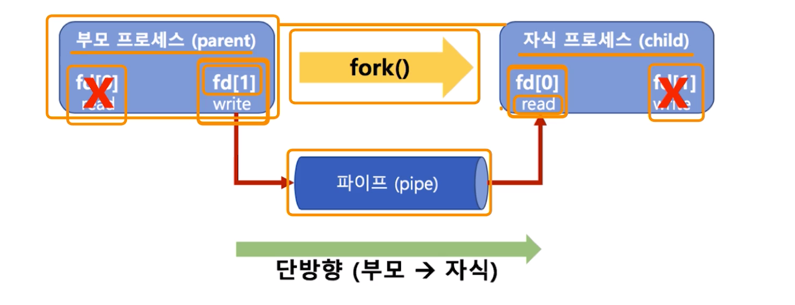
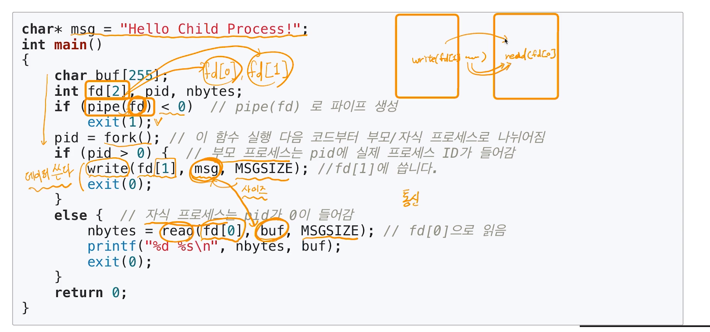
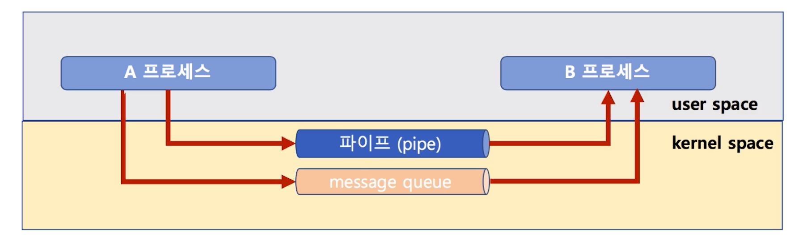
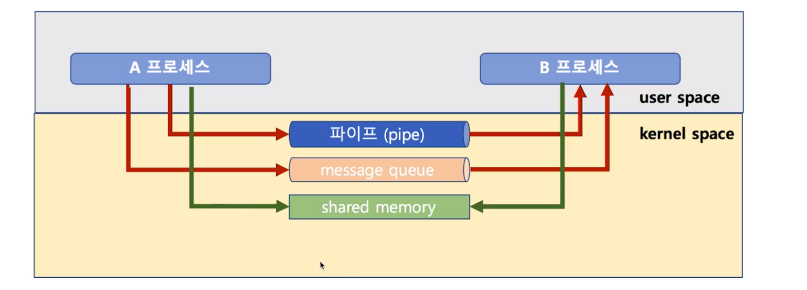

# 제 31강 IPC 기법1 
## 다양한 IPC 기법 
### IPC: InterProcess Communication 
1. file 사용 
2. Message Queue
3. Shared Memory 
4. Pipe 
5. Signal 
6. Semaphore 
7. Socket 
...

---
## 파이프 
- pipe (파이프)
  - 기본 파이프는 단방향 통신 
  - fork()로 자식 프로세스 만들었을 때, 부모와 자식간의 통신 



---
## 파이프코드 예제


---
## 메시지 큐(message queue)
- 큐니까, 기본은 FIFO 정책으로 데이터 전송 

---
## 메시지 큐 코드 예제 
- A 프로세스 
```
    msqid = msgget(key, msgflag) // key는 1234, msgflag는 옵션
    msgsnd(msqid, &sbuf, buf_length, IPC_NOWAIT)
```
- B 프로세스 
```
    msqid = msgget(key, msgflag) // key는 동일하게 1234로 해야 해당 큐의 msgid를 얻을 수 있음 
    msgrcv(msqid, &rbuf, MSGSZ, 1, 0)
```

---
## 파이프와 메시지 큐 
- message queue는 부모/자식이 아니라, 어느 프로세스 간에라도 데이터 송수신이 가능 
- 먼저 넣은 데이터가 먼저 읽혀진다. 

## pipe VS message queue
- 파이프: 부모/자식 프로세스간 only, 메시지 큐는 아님
- 파이프: 단방향만 가능, 메시지 큐: 양방향 가능 

---
## IPC 기법과 커널 모드 
> pipe, message queue는 모두 kernel 공간의 메모리를 사용합니다. 



> 메모리 공간도 kernel/user로 구분됩니다. 

---
## 공유 메모리(shared memory)
- 노골적으로 kernel space에 메모리 공간을 만들고, 해당 공간을 변수처럼 쓰는 방식 
- message queue처럼 FIFO 방식이 아니라, 해당 메모리 주소를 마치 변수처럼 접근하는 방식 
- 공유메모리 key를 가지고, 여러 프로세스가 접근 가능 



---
## 공유 메모리 코드 예제 
1. 공유 메모리 생성 및 공유 메모리 주소 얻기 
```
    shmid = shmget((key_t) 1234, SIZE, IPC_CREAT|0666))
    shmaddr = shmat(shmid, (void *)0, 0)
```
2. 공유 메모리에 쓰기 
```
    strcpy((char *)shmaddr, "Linux Programming")
```
3. 공유 메모리에서 읽기 
```
    printf("%s\n", (char *)shmaddr)
```

---
## 정리 
1. 주요 IPC 기법 
- pipe : 단방향 통신, 부모/자식 프로세스 (fork()로 생성)
- message queue : key 값을 여러개 만들어서 양방향 통신 
- shared memory : 커널에 공유 메모리를 만들어서 해당 메모리에 만들어진 주소값으로 변수처럼 사용하면서 공유함 

2. 모두 커널 공간을 활용해서 프로세스간 데이터 공유 
