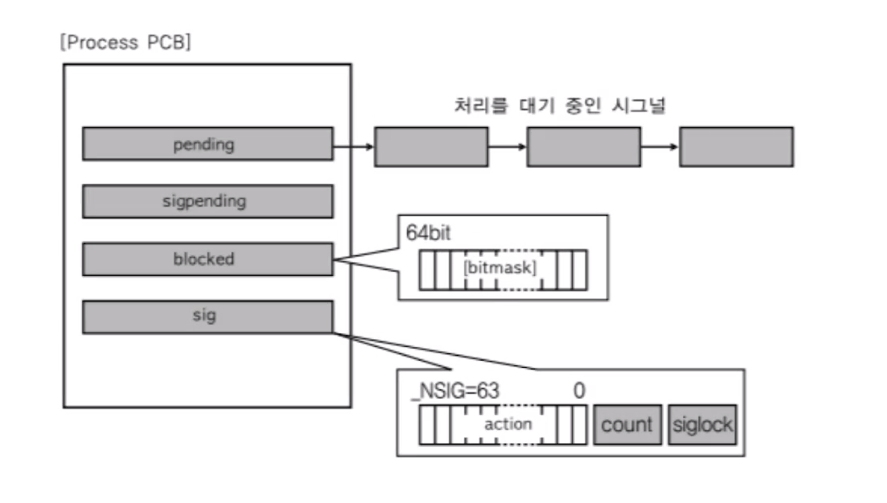
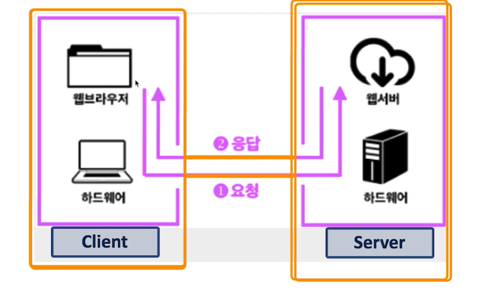
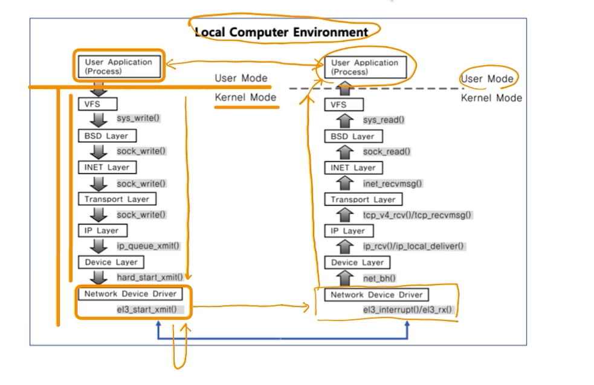

# 제 32강 IPC 기법2 
## 프로세스간 커뮤니케이션 
### - 각 IPC 기법 개념 이해하기 (signal과 socket)

> IPC 기법이지만, 이외에도 많이 사용되는 두 가지 기술 
- 많이 사용하는 두 가지! 
  - 시그널(signal)
  - 소켓(socket)

---
## 시그널(signal)
- 유닉스에서 30년 이상 사용된 전통적인 기법 
- 커널 또는 프로세스에서 다른 프로세스에 어떤 이벤트가 발생되었는지를 알려주는 기법 
- 프로세스 관련 코드에 관련 시그널 핸들러를 등록해서, 해당 시그널 처리 실행 
  - 시그널 무시 
  - 시그널 블록(블록을 푸는 순간, 프로세스에 해당 시그널 전달)
  - 등록된 시그널 핸들러로 특정 동작 수행 
  - 등록된 시그널 핸들러가 없다면, 커널에서 기본 동작 수행 

---
## 주요 시그널 
> 주요 시그널: 기본 동작 
- SIGKILL: 프로세스를 죽여라(슈퍼관리자가 사용하는 시그널로, 프로세스는 어떤 경우든 죽도록 되어있음)
- SIGALARM: 알람을 발생한다 
- SIGSTP: 프로세스를 멈춰라(Ctrl + z)
- SIGCONT: 멈춰진 프로세스를 실행해라 
- SIGINT: 프로세스에 인터럽트를 보내서 프로세스를 죽여라(Ctrl + c)
- SIGSEGV: 프로세스가 다른 메모리영역을 침범했다. 
> 시그널 종류: kill -l 

---
## 시그널 관련 코드 예제 
- 시그널 핸들러 등록 및 핸들러 구현 
```c
static void signal_handler (int signo) {
    printf("Catch SIGINT! \n");
    exit (EXIT_SUCCESS);
}

int main (void) {
    // signal_handler 함수를 실행시킴
    if(signal (SIGINT, signal_handler) == SIG_ERR) {
        printf("Can't catch SIGINT! \n");
        exit (EXIT_FAILURE);
    }

    for(;;)
        pause();

    return 0;    
}
```

```c

int main (void) {
    // SIG_IGN -> 변수 아님 
    if (signal (SIGINT, SIG_IGN) == SIG_ERR) {
        printf("Can't catch SIGINT!\n");
        exit (EXIT_FAILURE);
    }

    for(;;)
        pause();

    return 0;        
}
```

---
## 시그널과 프로세스 
- PCB에 해당 프로세스가 블록 또는 처리해야하는 시그널 관련 정보 관리
- 커널모드에서 사용자 모드로 전환시 시그널 처리 


---
## 소켓(socket)
- 소켓은 네트워크 통신을 위한 기술 
- 네트워크 기능을 사용할 수 있는 시스템콜(?)
- 기본적으로는 클라이언트와 서버 등 두 개의 다른 컴퓨터간의 네트워크 기반 통신을 위한 기술 



---
소켓(socket)과 IPC 

- 소켓을 하나의 컴퓨터 안에서, 두 개의 프로세스간에 통신 기법으로 사용 가능



---
## 정리 
- 다양한 IPC 기법을 활용해서, 프로세스간 통신이 가능하다. 
- IPC 기법 이외에도 사용할 수 있는 다음 두 가지 기술 개념을 알아둡니다. 
  - 시그널(signal)
  - 소켓 

