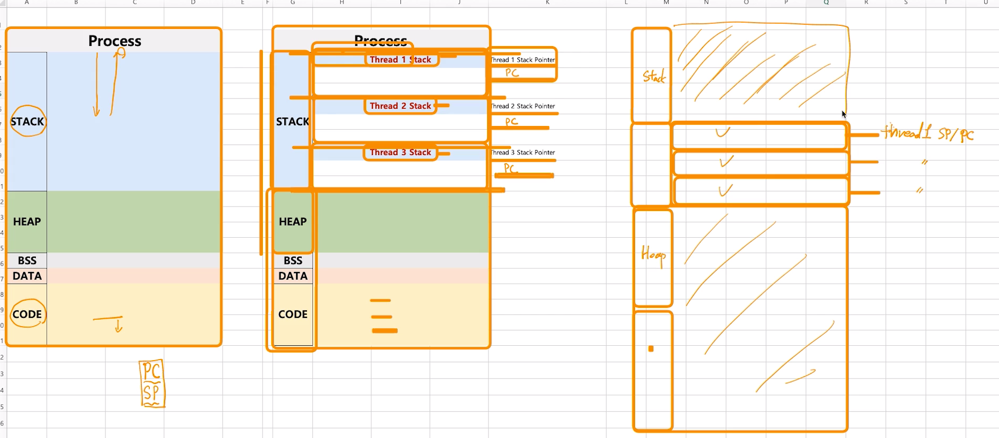
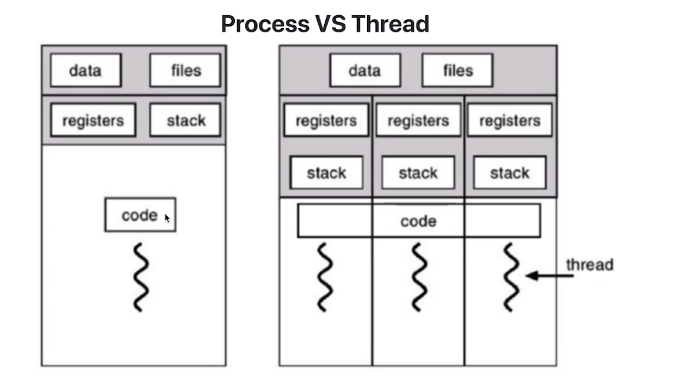
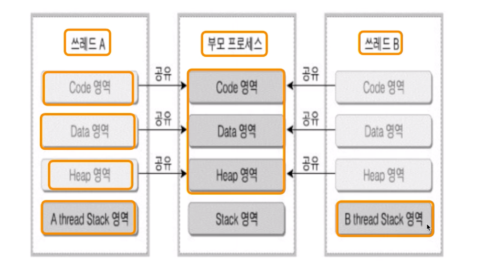

# 제 34강 스레드 개념 
## Thread 개념 
- Light Weight Process 라고도 함 
- 프로세스 
  - 프로세스 간에는 각 프로세스의 데이터 접근이 불가 (IPC를 사용 - 프로세스간 데이터 접근이 가능하게 해줌)
- 스레드 
  - 하나의 프로세스에 여러개의 스레드 생성 가능 
  - 스레드들은 동시에 실행 가능 
  - 프로세스 안에 있으므로 프로세스의 데이터를 모두 접근 가능 (IPC를 사용할 필요 없음)

---

- Thread는 각기 실행이 가능한 stack 존재 
- 정확히는 프로세스의 stack과 heap 영역 사이에 thread가 존재하기 때문에 프로세스 내의 데이터 접근이 가능함 
  - 그렇기 때문에 다른 프로세스에 생긴 스레드는 공유가 안됨, 하나의 프로세스 안에서 생성된 스레드끼리 데이터 공유가 가능함 

---
## Multi Thread(멀티 스레드)
- 소프트웨어 병행 작업 처리를 위해 Multi Thread를 사용함 

--
## 멀티 프로세싱과 Thread 
- 멀티 태스킹과 멀티 프로세싱 
  - 멀티 태스킹: 하나의 CPU에 여러 프로세스 
  - 멀티 프로세싱: 하나의 프로세스를 여러개의 CPU를 활용해서 실행(병릴 실행을 통해 CPU 속도를 높임)
    - 하나의 프로세스를 어떻게 나눌 수 있을까? -> Thread를 여러개 만들면 가능  

