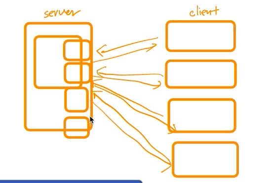
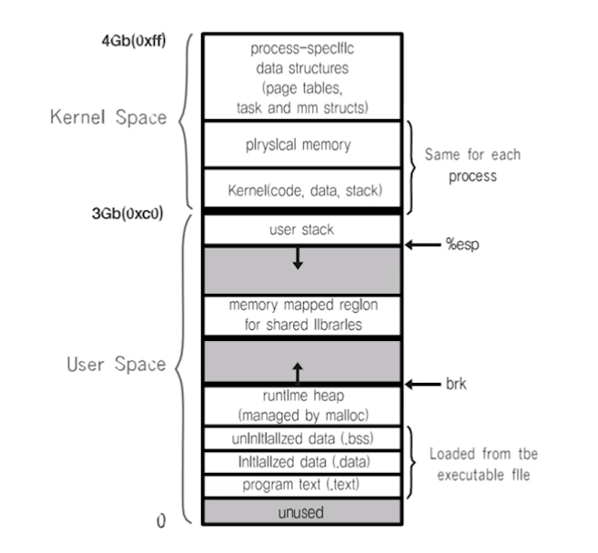
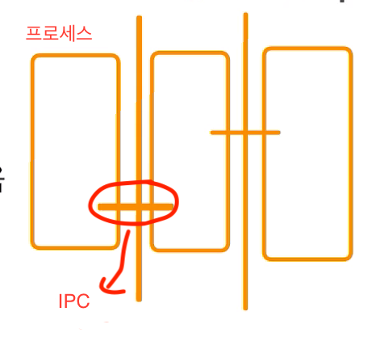
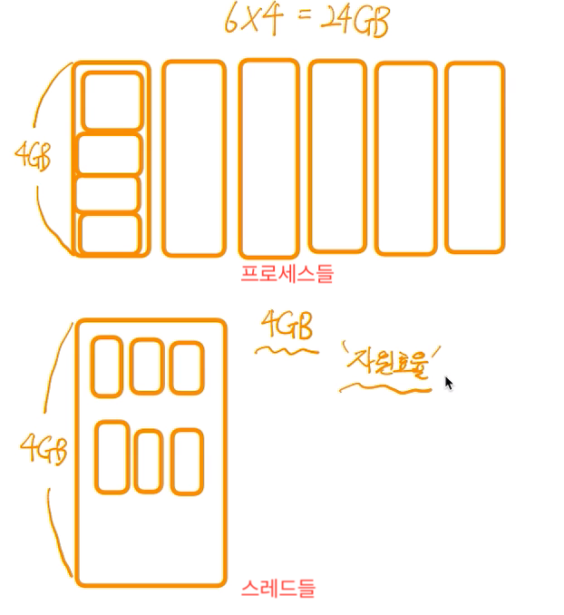
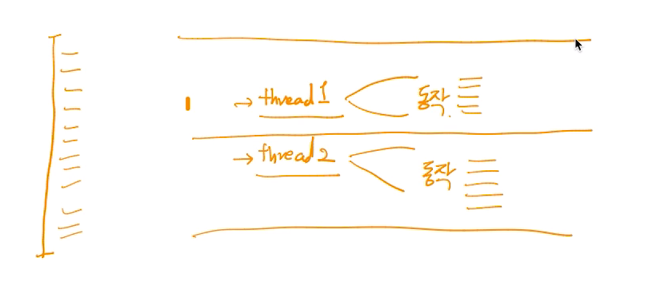
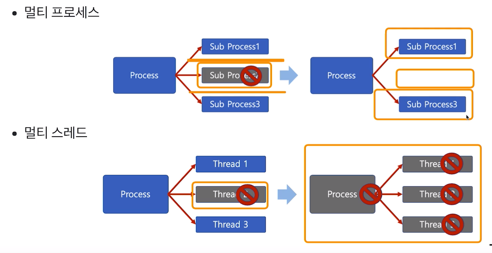

# 제 35강 스레드 장단점 
## Thread 장점1 
1. 사용자에 대한 응답성 향상 

- 웹서버와 클라이언트가 있다면 요청할 때마다 데이터를 전달해주려면 하나의 서버가 응답시간이 빨라지는 부분이 있어서 새로운 클라이언트가 오면 별도의 스레드, 별도의 프로세스(멀티 프로세싱)를 만든다. 

---
## Thread 장점2 
2. 자원 공유 효율 
- IPC(Inter-Process Communication) 기법과 같이 프로세스간 자원 공유를 위해 번거로운 작업이 필요없음
- 프로세스 안에 있으므로 프로세스의 데이터를 모두 접근 가능 

- IPC

- 프로세스들과 스레드들 

---
## Thread 장점3
3. 작업이 분리되어 코드가 간결 
- 사실 작성하기 나름 
- 함수가 각각 동작하여 분리된 것으로 보임 

---
## Thread 단점 
- 스레드 중 한 스레드만 문제가 있어도 전체 프로세스가 영향을 받음 
- 멀티 프로세스 
  - 프로세스 하나가 죽어도 나머지는 살아 있음 
- 멀티 스레드 
  - 스레드 하나만 문제가 되도 전체 프로세스가 문제 생김 

- 스레드를 많이 생성하면, Context Switching이 많이 일어나 성능 저하 
- 예) 리눅스 OS에서는 Thread를 Process와 같이 다룸 
  - 스레드를 많이 생성하면, 모든 스레드를 스케줄링해야 하므로, Context Switching이 빈번할 수 밖에 없음 

---
## Thread vs Process 
- 프로세스는 독립적, 스레드는 프로세스의 서브셋 
- 프로세스는 각각 독립적인 자원을 가짐, 스레드는 프로세스 자원 공유 
- 프로세스는 자신만의 주소영역을 가짐, 스레드는 주소영역 공유   
- 프로세스간에는 IPC 기법으로 통신해야함, 스레드는 필요없음 

--- 
## PThread
- POSIX 스레드(POSIX Threads, 약어: PThread)
  - Thread 관련 표준 API 

---
## 정리 
- Thread 개념 정리 
  - 프로세스와 달리 스레드간 자원 공유 

- 스레드 장점 
  - CPU 활용도를 높이고 
  - 성능 개선 가능 
  - 응답성 향상 
  - 자원 공유 효울(IPC를 안써도 됨)

- 스레드 단점 
  - 하나의 스레드 문제가 프로세스 전반에 영향을 미침 
  - 여러 스레드 생성시 성능 저하 가능 