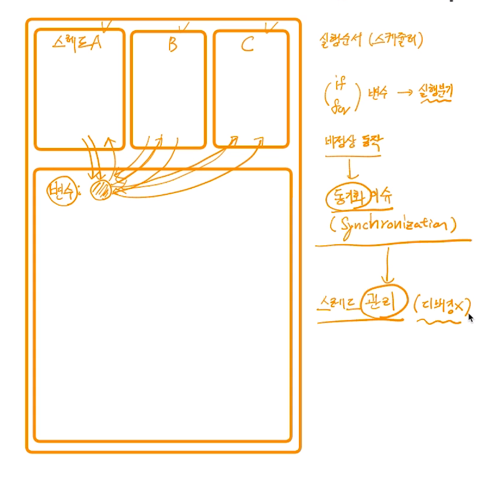

# 제 36강 스레드 동기화 문제 
## 동기화(Synchronization) 이슈 예제 



---
## 스레드 동기화 설명


---
## mutual exclusion 
```python

import threading

g_count = 0

def thread_main():
    global g_count
    lock.acquire() // 다른 스레드가 사용하고 있으면 lock
    for i in range(1000000):
        g_count = g_count + 1
        lock.release()

lock = threading.Lock()
threads = []

for i in range(50):
    th = threading.Thread(target = thread_main)
    threads.append(th)

for th in threads:
    th.start()

for th in threads: 
    th.join()

print('g_count = ', g_count)            

// g_count = 50000000
```


