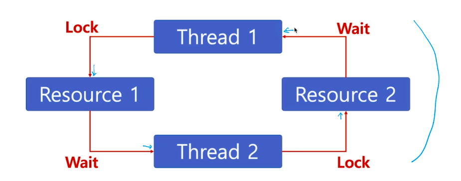

# 제 38강 deadlock과 starvation 
## 교착상태(Deadlock)와 기아상태(Starvation)

---
## 교착상태(Deadlock)란?
- 무한 대기 상태: 두 개 이상의 작업이 서로 상대방의 작업이 끝나기만을 기다리고 있기 때문에 다음 단계로 진행하지 못하는 상태

> 배치처리 시스템에서는 일어나지 않는 문제  
> 프로세스, 스레드 둘다 이와 같은 상태가 일어날 수 있음 

---
## 참고: 교착상태 발생조건 
- 다음 네 가지 조건이 모두 성립할 때, 교착상태 발생 가능성이 있음
1. 상호배제(Mutual exclusion): 프로세스들이 필요로하는 자원에 대해 배타적인 통제권을 요구한다. 
2. 점유 대기(Hold and wait): 프로세스가 할당된 자원을 가진 상태에서 다른 자원을 기다린다.
3. 비선점(No preemption): 프로세스가 어떤 자원의 사용을 끝낼 때까지 그 자원을 뺏을 수 없다.
4. 순환대기(Circular wait): 각 프로세스는 순환적으로 다음 프로세스가 요구하는 자원을 가지고 있다. 

---
## 기아 상태(Starvation)
- 특정 프로세스의 우선순위가 낮아서 원하는 자원을 계속 할당받지 못하는 상태 
- 교착상태와 기아상태
  - 교착 상태는 여러 프로세스가 동일 자원 점유를 요청할 때 발생 
  - 기아 상태는 여러 프로세스가 부족한 자원을 점유하기 위해 경쟁할 때, 특정 프로세스는 영원히 자원할당이 안되는 경우를 주로 의미함

---
## 기아상태 해결방안 
- 우선순위 변경 
  - 프로세스 우선순위를 수시로 변경해서 각 프로세스가 높은 우선순위를 가질 기회 주기   
  - 오래 기다린 프로세스의 우선순위를 높여주기 
  - 우선순위가 아닌, 요청 순서대로 FIFO 기반 요청큐 사용