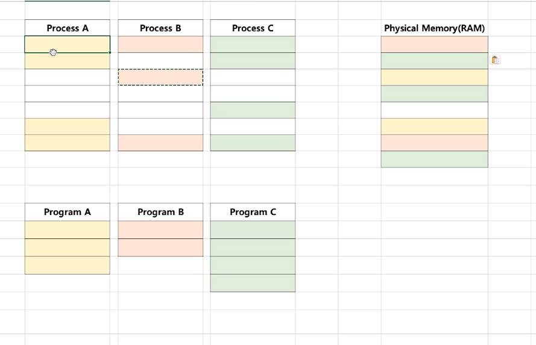

# 제 39강 가상 메모리 개념
## 가상 메모리 
> 실제 각 프로세스마다 충분한 메모리를 할당하기에는 메모리 크기가 한계가 있음 
- 예: 리눅스는 하나의 프로세스가 4GB임 
- 통상 메모리는 8GB? 16GB?
> 폰노이만 구조 기반이므로 코드는 메모리에 반드시 있어야함

---
## 가상 메모리가 필요한 이유 
- 하나의 프로세스만 실행 가능한 시스템(배치 처리시스템 등) 
  - 이러한 시스템에서는 가상 메모리가 필요없음 
  1. 프로그램을 메모리로 로드(load)
  2. 프로세스 실행 
  3. 프로세스 종료(메모리 해제)

- 여러 프로세스 동시 실행 시스템 
  1. 메모리 용량 부족 이슈 
  2. 프로세스 메모리 영역간에 침범 이슈   

  

---
- 가상 메모리: 메모리가 실제 메모리보다 많아 보이게 하는 기술 
  - 실제 사용하는 메모리는 작다는 점에서 착안해서 고안된 기술 
  - 프로세스간 공간 분리로, 프로세스 이슈가 전체 시스템에 영향을 주지 않을 수 있음   

 

---
- 가상 메모리 기본 아이디어 
  - 프로세스는 가상 주소를 사용하고, 실제 해당 주소에서 데이터를 읽고/쓸때만 물리 주소로 바꿔주면 된다. 
  - virtual address(가상 주소): 프로세스가 참조하는 주소 
  - physical address(물리 주소): 실제 메모리 주소 

- MMU(Memory Management Unit)
  - CPU에 코드 실행시, 가상 주소 메모리 접근이 필요할 때, 해당 주소를 물리 주소값으로 변환해주는 하드웨어 장치

---
## 가상 메모리(Virtual Memory System)와 MMU 
- CPU는 가상 메모리를 다루고, 실제 해당 주소 접근 시 MMU 하드웨어 장치를 통해 물리 메모리 접근
  - 하드웨어 장치를 이용해야 주소 변환이 빠르기 때문에 별도 장치를 둠 

    