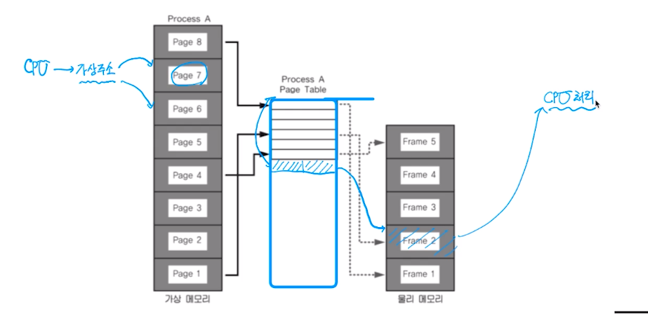
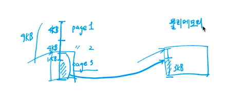
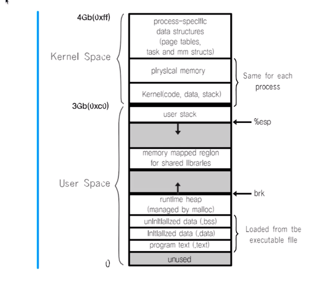
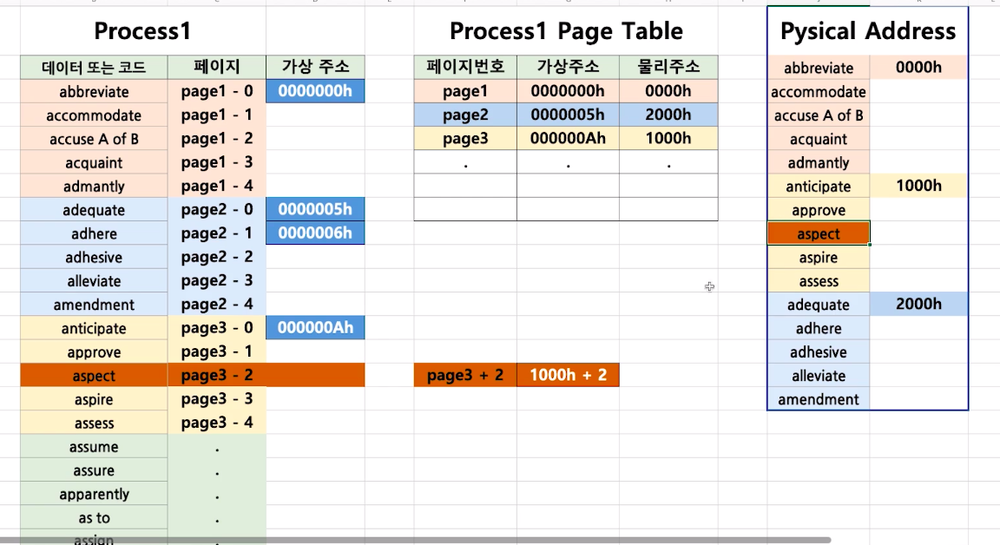
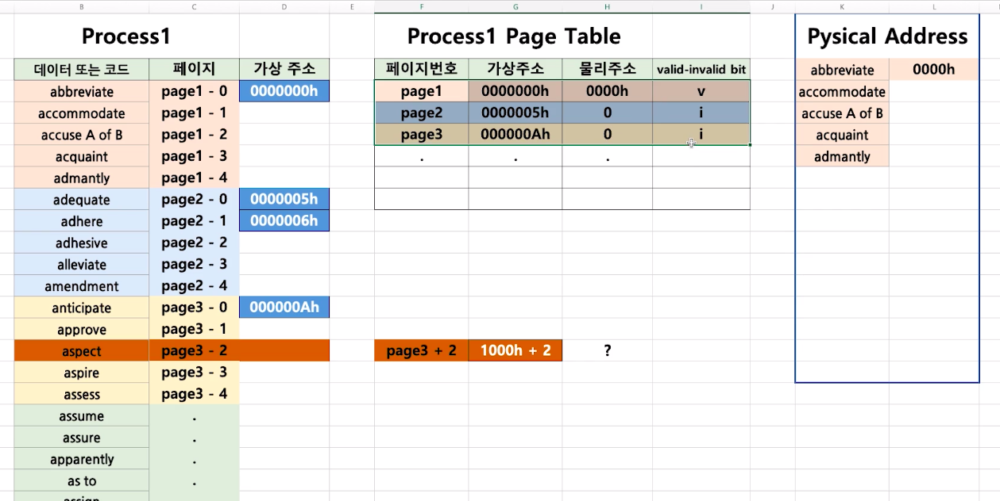
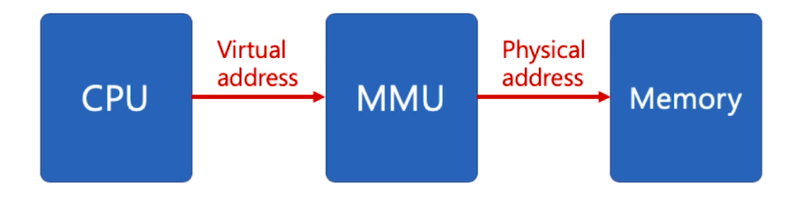

# 제 40강 페이징 시스템
## 페이징 시스템(Paging System)
- 페이징(paging) 개념 
  - 크기가 동일한 페이지로 가상 주소 공간과 이에 매칭하는 물리 주소 공간을 관리 
  - 하드웨어 지원이 필요 
    - 예) Intel x86 시스템(32bit)에서는 4KB, 2MB, 1GB 지원 
  - 리눅스에서는 4KB로 페이징 
  - 페이지 번호를 기반으로 가상 주소/물리 주소 매핑 정보를 기록/사용 

---
- 프로세스(4GB)의 PCB에 Page Table 구조체를 가리키는 주소가 들어있음 
- Page Table에는 가상주소와 물리 주소간에 매핑정보가 있음 

---
## 페이징 시스템 구조 
- page 또는 page frame: 고정된 크기의 block(4KB)

 

- paging system 
  - 가상 주소: v = (p, d)
    - p : 가상 메모리 페이지 
    - d : p 안에서 참조하는 위치(변위)
    - base 주소가 있다면 그 주소에 페이지 사이즈(크기)를 더해주면 원하는 주소를 찾을 수 있다 

  

- 페이지 크기가 4KB 예 
  - 가상 주소의 0비트에서 11비트가 변위(d)를 나타내고, 
  - 12비트 이상이 페이지 번호가 될 수 있음        
  - 페이지번호 주소에 변위를 더하면 실제 메모리 주소를 구할 수 있음

---
## 쉬었다 가기 - 모든 것은 결국 bit와 연결 
- 프로세스가 4GB를 사용하는 이유 - 32bit 시스템에서 2의 32승이 4GB 

---
## 페이지 테이블(page table) 
- page table 
  - 물리 주소에 있는 페이지 번호와 해당 페이지의 첫 물리 주소 정보를 매핑한 표 
  - 가상 주소 v = (p, d) 라면 
    - p: 페이지 번호 
    - d: 페이지 처음부터 얼마 떨어진 위치인지 

- paging system 동작 
  - 해당 프로세스에서 특정 가상 주소 엑세스를 하려면 
    - 해당 프로세스의 page table에 해당 가상 주소가 포함된 page번호가 있는지 확인 
    - page 번호가 있으면 이 page가 매핑된 첫 물리주소를 알아내고(p`)
    - p`+d가 실제 물리 주소가 됨 

 

       

- valid, invalid로 비트부호로 실제 데이터가 존재하는지 아닌지 알려주는 컬럼을 넣는다. 

---
## 페이징 시스템과 MMU(컴퓨터 구조)
- CPU는 가상 주소 접근시 
  - MMU 하드웨어 장치를 통해 물리 메모리 접근 

    

- 프로세스 생성시, 페이지 테이블 정보 생성 
  - PCB 등에서 해당 페이지 테이블 접근 가능하고, 관련 정보는 물리 메모리에 적재 
  - 프로세스 구동시, 해당 페이지 테이블 base 주소가 별도 레지스터에 저장(CR3) 
  - CPU가 가상 주소 접근시, MMU가 페이지 테이블 base 주소를 접근해서, 물리 주소를 가져옴 
