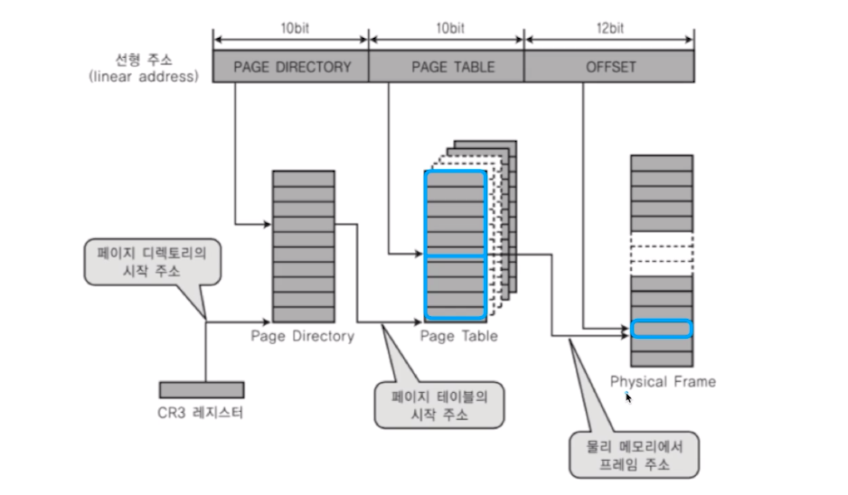
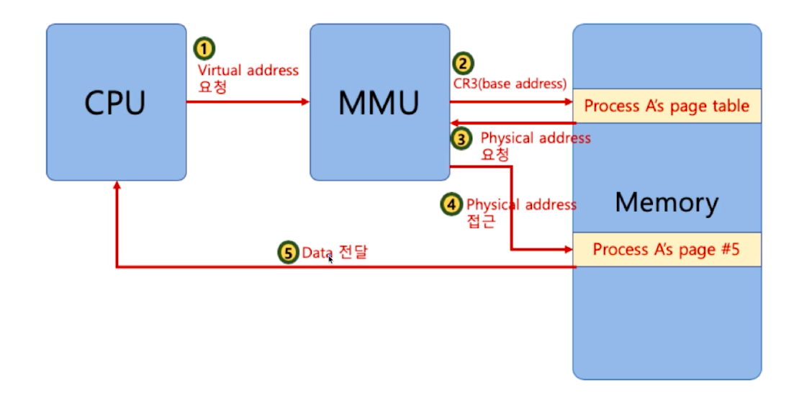
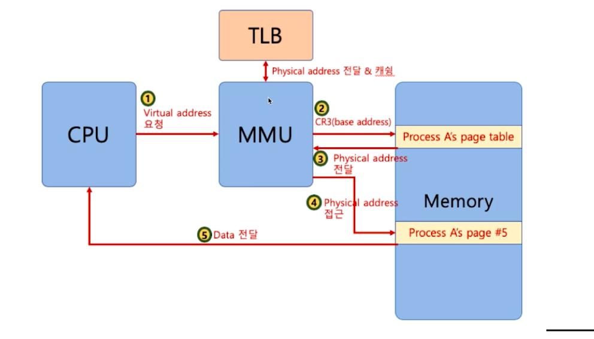
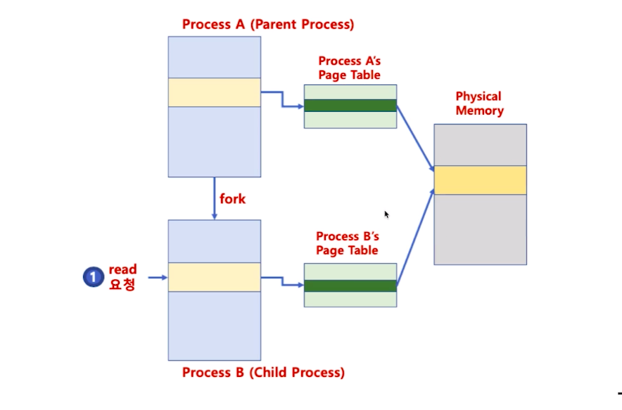
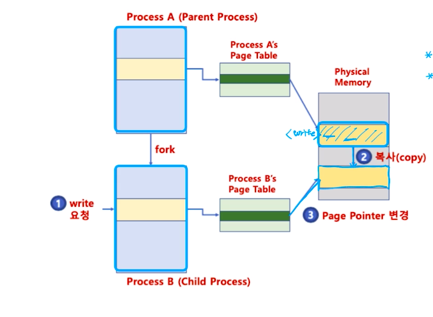

# 제 41강 다중 단계 페이징 시스템과 페이징 시스템 장점
## 다중 단계 페이징 시스템 
- 32bit 시스템에서 4KB 페이지를 위한 페이징 시스템은 
  - 하위 12bit 오프셋 또는 변위(페이지에서 얼마나 떨어져있는지 나타냄)
  - 상위 20bit가 페이징 번호이므로, 2의 20승(1048576)개의 페이지 정보가 필요함 

- 페이징 정보를 단계를 나누어 생성 
  - 필요없는 페이지는 생성하지 않으면, 공간절약 가능

- 페이지 번호를 나타내는 bit를 구분해서 단계를 나눔(리눅스는 3단계, 최근 4단계)

---
## MMU와 TLB(컴퓨터 구조)
- MMU가 물리 주소를 확인하기 위해 메모리를 갔다와야 함 

- TLB(Translation Lookaside Buffer): 페이지 정보 캐쉬 

---
## 페이징 시스템과 공유 메모리 
- 프로세스간 동일한 물리 주소를 가리킬 수 있음(공간 절약, 메모리 할당 시간 절약) 
- 프로세스 B가 생길 때는 프로세스 A를 복사하지 않는다. 프로세스 하나 전체를 복사하는데 시간이 많이 걸리기 때문에 프로세스 A가 사용하는 메모리에서 프로세스 B가 사용할 수 있는 페이지 테이블만 생긴다 

- 물리 주소 데이터 변경시 
  - 물리 주소에 데이터 수정 시도할 경우, 물리 주소를 복사할 수 있음(copy-on-write)

- 페이징시스템과 공유메모리를 사용하면 프로세스 생성 시간을 줄여준다
- 커널, 공유 메모리든 공유 데이터든 물리 메모리를 통한 공유
  - 페이지 테이블, 페이지 물리주소만 바꾸면 가능 
  - 그래서 공간 절약이 가능하다   
