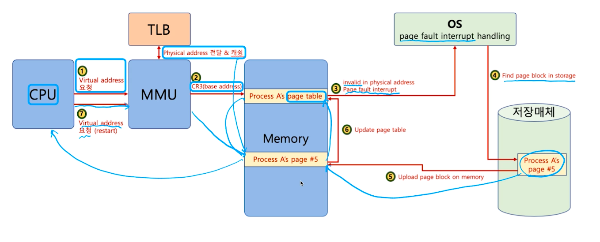

# 제 42강 페이지 폴트 
## 요구 페이징(Demand Paging 또는 Demanded Paging) 
- 프로세스 모든 데이터를 메모리로 적재하지 않고, 실행 중 필요한 시점에서만 메모리로 적재함 
  - 선행 페이징(anticipatory paging 또는 prepaging)의 반대개념: 미리 프로세스 관련 모든 데이터를 메모리에 올려놓고 실행하는 개념 
  - 더 이상 필요하지 않은 페이지 프레임은 다시 저장매체에 저장(페이지 교체 알고리즘) 

---
## 페이지 폴트(Page Fault)
- 어떤 메모리가 실제 물리 메모리에 없을 때 일어나는 인터럽트 
- 운영체제가 page fault가 일어나면, 해당 페이지를 물리 페이지에 올림 
- 페이지 테이블에서 valid 체크에서 요청한 메모리가 물리 메모리에 없다는 걸 확인하면 요청한 메모리를 물리 메모리에 등록하고 페이지 테이블의 물리 메모리를 가리키는 주소와 valid 체크를 업데이트 해주고 등록한 물리 메모리를 찾아옴

---
## 페이지 폴트와 인터럽트 

---
## 생각해보기 
- 페이지 폴트가 자주 일어나면? 
  - 실행 되기 전에 해당 페이지를 물리 메모리에 올려야함 
    - 실행이 오래 걸림 
- 페이지 폴트가 안 일어나게 하려면? 
  - 향후 실행/참조될 코드/데이터를 미리 물리 메모리에 올리면 됨
    - 앞으로 있을 일을 예측해야함 <- 신의 영역    