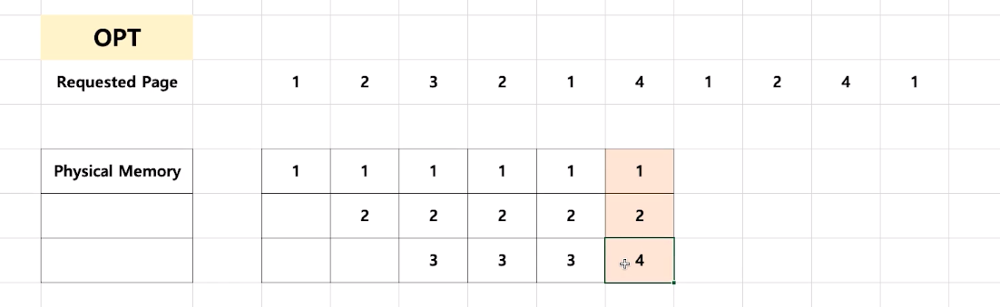
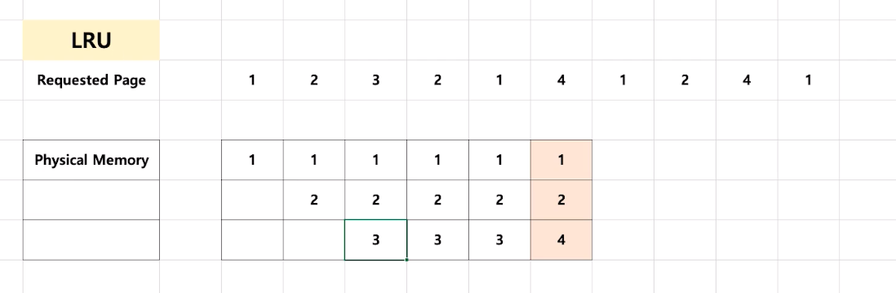
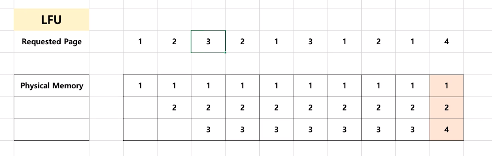
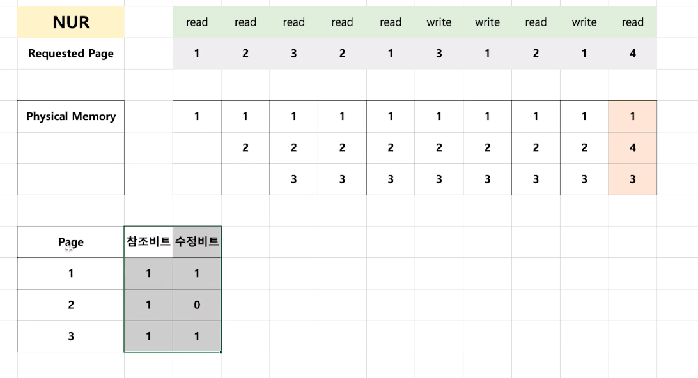
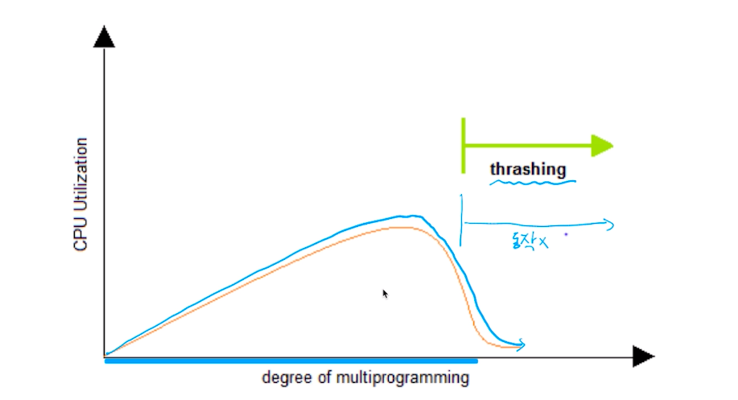

# 제 43강 페이지 교체 알고리즘 
## 페이지 교체 정책(page replacement policy) 
- 운영체제가 특정 페이지를 물리 메모리에 올리려 하는데, 물리 메모리가 다 차있다면? 
  - 기존 페이지 중 하나를 물리 메모리에서 저장매체로 내리고(저장)
  - 새로운 페이지에 해당 물리 메모리 공간을 올린다. 
> 어떤 페이지를 물리 메모리에서 저장 매체로 내릴 것인가? -> Page Replacement(Swapping) Algorithm

---
## 페이지 교체 알고리즘(FIFO) 
- FIFO Page Replacement Algorithm 
  - 가장 먼저 들어온 페이지를 내리자 

## 페이지 교체 알고리즘(OPT)
- 최적 페이지 교체 알고리즘(OPTimal Replacement Algorithm)
  - 앞으로 가장 오랫동안 사용하지 않을 페이지를 내리자 
  - 일반 OS에는 구현불가      
  - 아래의 예시는 메모리가 꽉 찼을 때 향후 3번에 대한 요청은 없어서 3번 메모리를 교체

  

## 페이지 교체 알고리즘(LRU)
- LRU(Least Recently Used) Page Replacement Algorithm(가장 많이 사용되는 페이지 교체 알고리즘)
  - 가장 오래 전에 사용된 페이지를 교체 
  - OPT 교체 알고리즘이 구현이 불가하므로 과거 기록을 기반으로 시도
  - 아래의 예시는 4번 페이지 요청이 왔을 때 최신순으로 1,2,3이 들어왔으므로 3번을 교체

 

## 페이지 교체 알고리즘(LFU)
- LFU(Least Frequently Used) Page Replacement Algorithm 
  - 가장 적게 사용된 페이지를 내리자
  - 예시에서 1번 페이지는 4번, 2번 페이지는 3번, 3번 페이지는 2번만 사용했음
   
   

## 페이지 교체 알고리즘(NUR)
- NUR(Not Used Recently) Page Replacement Algorithm 
  - LRU와 마찬가지로 최근에 사용하지 않은 페이지부터 교체하는 기법 
  - 각 페이지마다 참조비트(R), 수정비트(M)을 둠(R,M)
    - (0,0), (0,1), (1,0), (1,1) 순으로 페이지 교체

  

---
## 스레싱(Thrashing)
- 반복적으로 페이지 폴트가 발생해서 과도하게 페이지 교체작업이 일어나 실제로는 아무일도 하지 못하는 상황 

