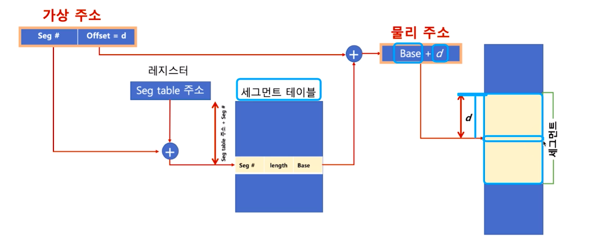
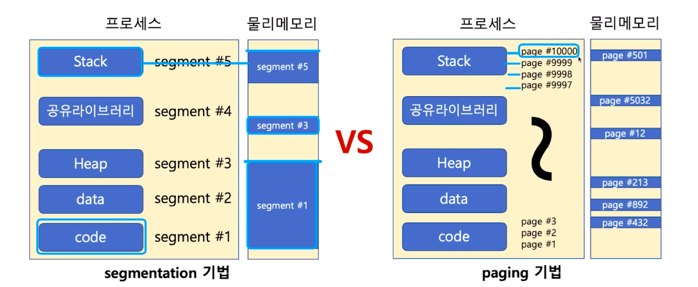
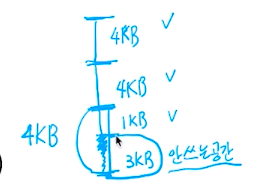
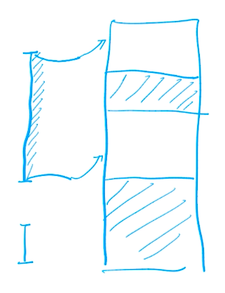

# 제 44강 세그멘테이션 기법 
## 세그멘테이션 <- 페이징 시스템이 가장 많이 쓰이므로 알아두기만 하자
- 가상 메모리를 서로 크기가 다른 논리적 단위인 세그먼트(segment)로 분할 
  - 페이징 기법에서는 가상 메모리를 같은 크기의 블록으로 분할 
  - 예: x86 리얼모드 
    - CS(Code Segment), DS(Data Segment), SS(Stack Segment), ES(Extra Segment)로 세그먼트를 나누어 메모리 접근

- 세그먼트 가상 주소 
  - v = (s,d) : s는 세그먼트 번호, d는 블록 내 세그먼트의 변위 

  

- 세그멘테이션은 크기가 다른 segment 단위로 물리 메모리에 로딩

---
## 참고 
- 내부 단편화(페이징 기법) 
  - 페이징 기법은 고정된 단위의 메모리를 가진다.(4KB)
  - 페이지 블록만큼 데이터가 딱 맞게 채워져 있지 않을 때 공간낭비

  
    
- 외부 단편화(세그멘테이션 기법)    
  - 물리 메모리가 원하는 연속된 크기의 메모리를 제공해주지 못하는 경우

    

- 세그멘테이션/페이징 모두 하드웨어 지원 필요 
  - 다양한 컴퓨터 시스템에 이식성을 중요시하는 리눅스는 페이징 기법을 기반으로 구현