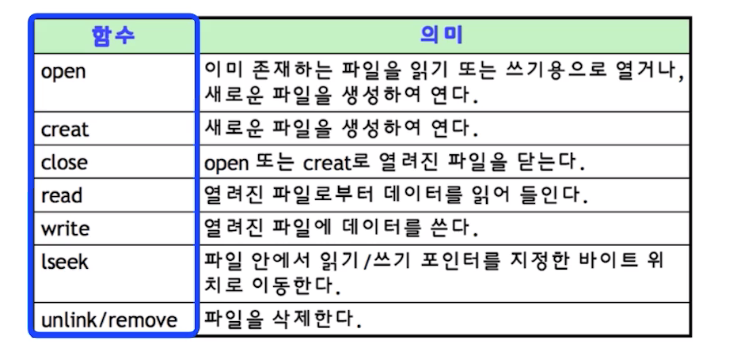

# 제 46강 파일 시스템 배경 이해하기 
## 파일 시스템 
- 파일 시스템: 운영체제가 저장매체에 파일을 쓰기 위한 자료구조 또는 알고리즘 

---
## 가볍게 알아두기: 파일 시스템이 만들어진 이유(블록)
- 0과 1의 데이터를 어떻게 저장매체에 저장할까? 
  - 비트로 관리하기는 오버헤드가 너무 큼 
  - 블록 단위로 관리하기로 함(보통 4KB)
  - 블록마다 고유 번호를 부여해서 관리 

---  
## 가볍게 알아두기: 파일 시스템이 만들어진 이유(파일)
- 사용자가 각 블록 고유 번호를 관리하기 어려움 
  - 추상적(논리적) 객체 필요: 파일 
- 사용자는 파일단위로 관리 
  - 각 파일에는 블록 단위로 관리   

---  
## 가볍게 알아두기: 파일 시스템이 만들어진 이유(저장 방법)
- 저장매체에 효율적으로 파일을 저장하는 방법 
  - 가능한 연속적인 공간에 파일을 저장하는 것이 좋음 
  - 외부 단편화, 파일 사이즈 변경 문제로 불연속 공간에 파일 저장 기능 지원 필요 
    - 블록 체인: 블록을 링크드 리스트로 연결 
    - 인덱스 블록 기법: 각 블록에 대한 위치 정보를 기록해서, 한 번에 끝 블록을 찾아갈 수 있도록 함   

---  
## 가볍게 알아두기: 다양한 파일 시스템    
- Windows: FAT, FAT32, NTFS 
  - 블록 위치를 FAT라는 자료 구조에 기록 
- 리눅스(UNIX) : ext2, ext3, ext4 
  - 일종의 인덱스 블록 기법인 inode 방식 사용 

---
## 파일 시스템과 시스템 콜 
- 동일한 시스템콜을 사용해서 다양한 파일 시스템 지원 가능토록 구현 
  - read/write 시스템 콜 호출시, 각 기기 및 파일 시스템에 따라 실질적인 처리를 담당하는 함수 구현 
    - 예: read_spec/write_spec 
  - 파일을 실제 어떻게 저장할지는 다를 수 있음 
    - 리눅스의 경우 ext4 외 NTFS, FAT32 파일 시스템 지원   

