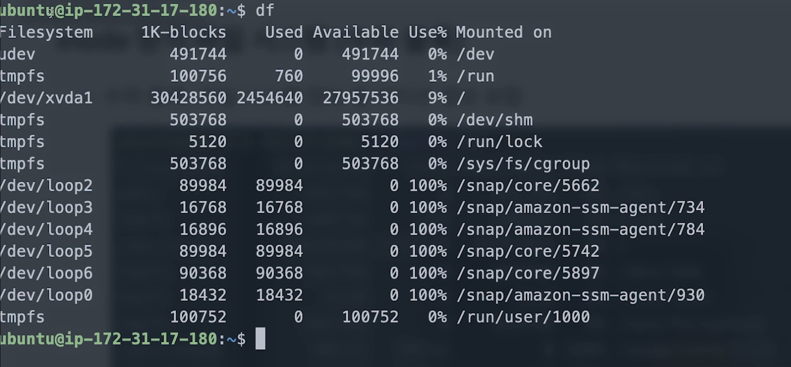
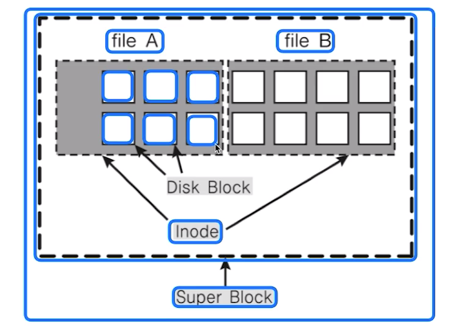
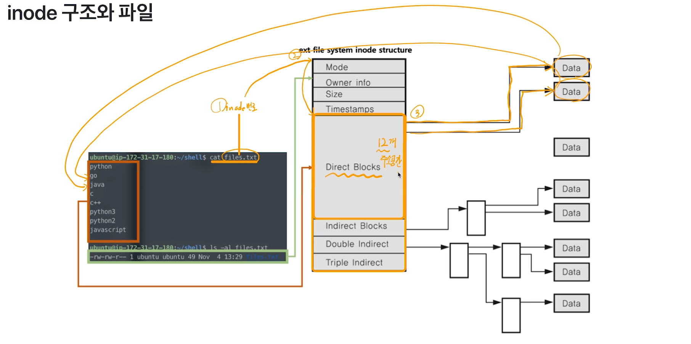
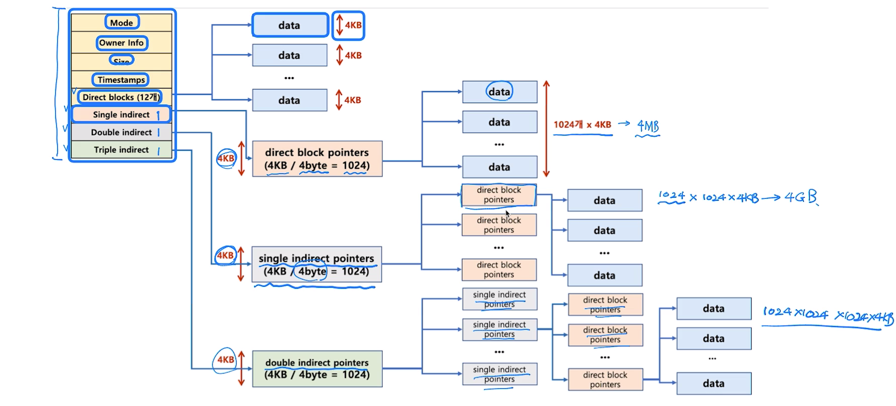
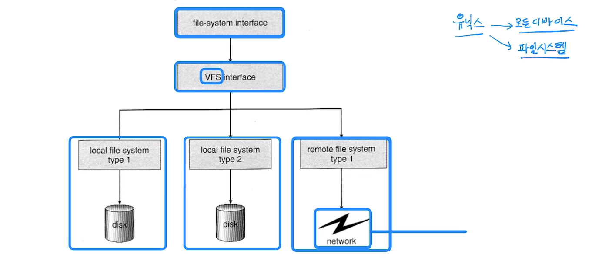

# 제 47강 inode 방식과 가상 파일 시스템
## inode 방식 파일 시스템 
- 파일 시스템 기본 구조 
  - 수퍼 블록: 파일 시스템 정보 
  - 아이노드 블록: 파일 상세 정보(PCB)
  - 데이터 블록: 실제 데이터 

---
## inode 방식 파일 시스템(수퍼 블록)
- 수퍼 블록: 파일 시스템 정보 및 파티션 정보 포함 
  - df 명령어: 슈퍼블록 정보 

---
## inode와 파일 
- 파일: inode 고유값과 자료구조에 의해 주요 정보 관리 
  - '파일이름:inode'로 파일이름은 inode번호와 매칭 
  - 파일 시스템에서는 inode를 기반으로 파일 엑세스 
  - inode 기반 메타 데이터 저장 
- 프로세스 생성 -> processID -> PCB -> 스케줄링 여러 작업 
- 파일 생성 -> inode 번호 -> inode 블록 -> 파일 처리 

---
## inode 구조 
- inode 기반 메타 데이터(파일 권한, 소유자 정보, 파일 사이즈, 생성 시간 등 시간 관련 정보, 데이터 저장 위치 등)

---
## inode 구조와 파일 데이터 
- single indirect: 4kb의 특정 블록을 가리키고, 실제 데이터가 아니라 주소값을 가지고 있음(direct block pointers) 
- double indirect: single indirect pointers(direct block pointers) 정보를 저장함
- triple indirect: double indirect pointers 정보를 저장함 

---
## 디렉토리 엔트리 
- 리눅스 파일 탐색: 예 - /home/ubuntu/link.txt
  - 각 디렉토리 엔트리(dentry)를 탐색 
    - 각 엔트리는 해당 디렉토리 파일/디렉토리 정보를 가지고 있음
  - '/' dentry에서 'home'을 찾고, 'home'에서 'ubuntu'를 찾고, 'ubuntu'에서 link.txt 파일이름에 해당하는 inode를 얻음 

  

---
## 가상 파일 시스템(Virtual File System)
- Network 등 다양한 기기도 동일한 파일 시스템 인터페이스를 통해 관리 가능 
- 예: read/write 시스템콜 사용, 각 기기별 read_spec/write_spec 코드 구현(운영체제 내부)
- 유닉스: 모든 디바이스를 파일처럼 다룬다. + 파일 시스템 

---
## 참고: 리눅스(유닉스) 운영체제 와 가상 파일 시스템 
- 모든 것은 파일이라는 철학을 따름 
  - 모든 인터렉션은 파일을 읽고, 쓰는 것처럼 이루어져있음 
  - 마우스, 키보드와 같은 모든 디바이스 관련된 기술도 파일과 같이 다루어짐 
  - **모든 자원에 대한 추상화 인터페이스로 파일 인터페이스를 활용**

---
## 참고: 특수 파일 
- 디바이스 
  - 블록 디바이스(Block Device)
    - HDD, CD/DVD와 같이 블록 또는 섹터 등 정해진 단위로 데이터 전송, IO 송수신 속도가 높음 
  - 캐릭터 디바이스(Character Device)  
    - 키보드, 마우스 등 byte 단위 데이터 전송, IO 송수신 속도가 낮음 