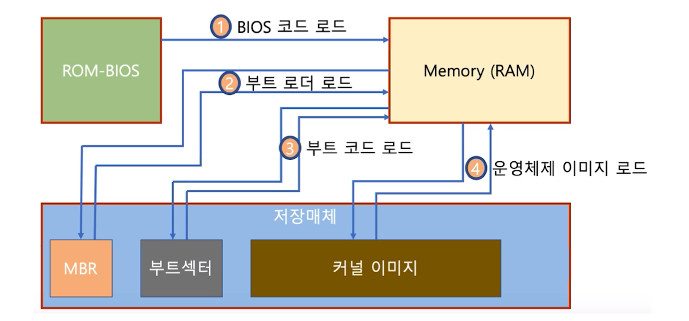

# 제 48강 부팅의 이해 
## Boot
- 컴퓨터를 켜서 동작시키는 절차 
- Boot 프로그램 
  - 운영체제 커널을 Storage에서 특정 주소의 물리 메모리로 복사하고 커널의 처음 실행위치로 PC를 가져다 놓는 프로그램 

---
## 부팅 과정 
- 컴퓨터를 켜면 
  - BIOS가 특정 Storage 읽어와 bootstrap loader를 메모리에 올리고 실행함 
  - bootstrap loader 프로그램이 있는 곳을 찾아서 실행시킴   
  - MBR(Master Boot Record): 파티션 테이블을 가지고 있고 그 테이블이 가지고 있는 주소값으로 부트섹터를 찾아감 

