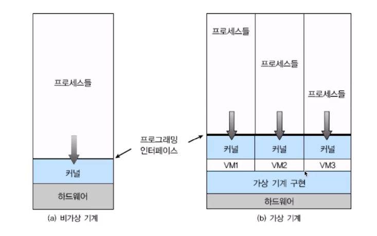
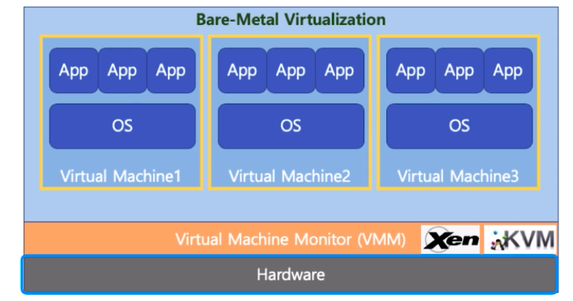
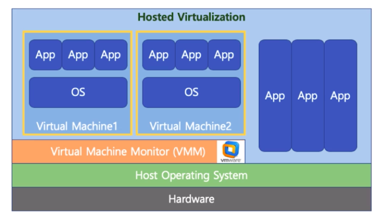
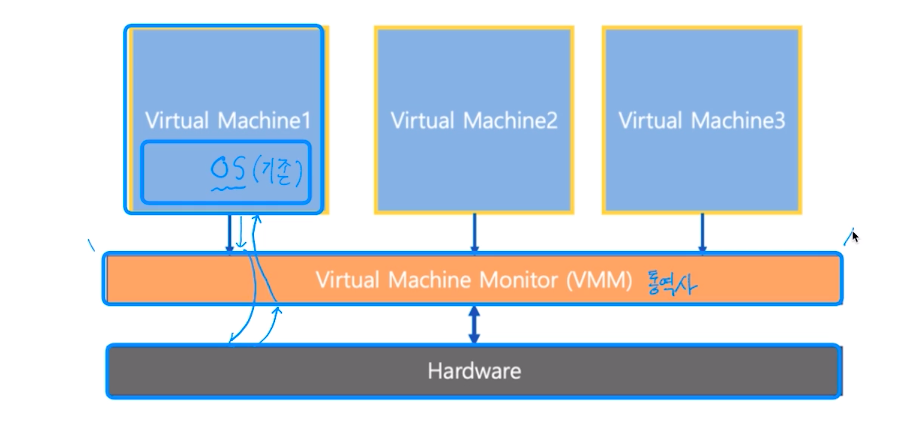
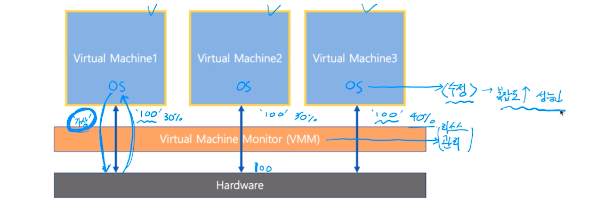
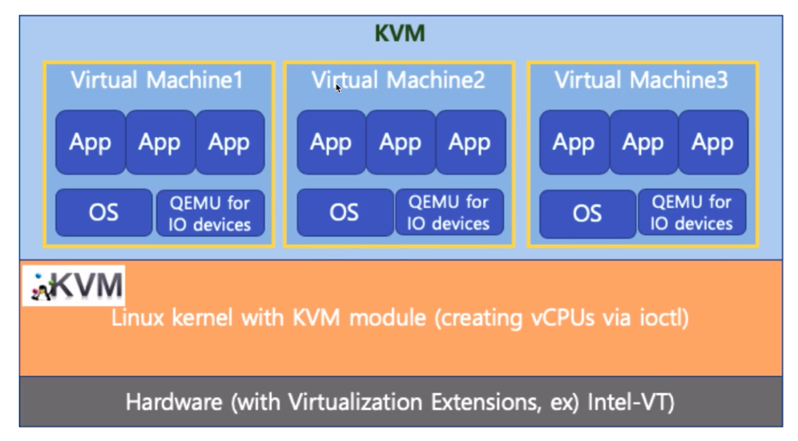
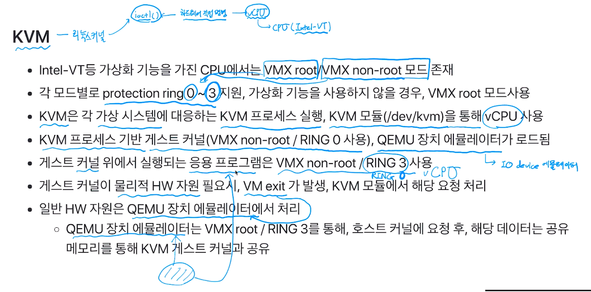
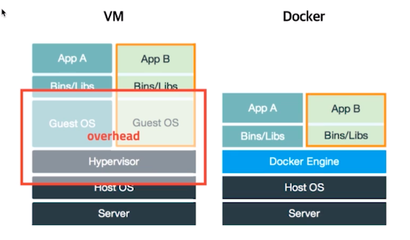
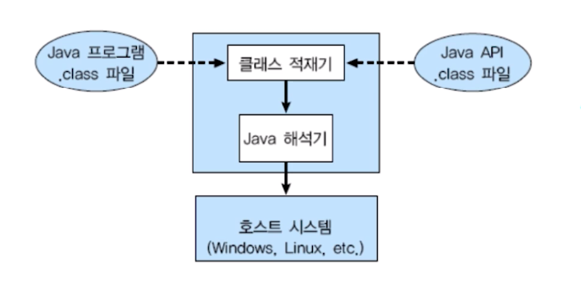

# 제 49강 가상 머신의 이해(참고)
## 가볍게 이해하기: Virtual Machine(가상 머신)
- 하나의 하드웨어(CPU, Memory 등)에 다수의 운영체제를 설치하고, 개별 컴퓨터처럼 동작하도록 하는 프로그램

---
## Virtual Machine Type1(native 또는 bare metal)
- 하이퍼 바이저(또는 VMM): 운영체제와 응용 프로그램을 물리적 하드웨어에서 분리하는 프로세스 
- 하이퍼 바이저 또는 버추얼 머신 모니터(VMM)라고 하는 소프트웨어가 하드웨어에서 직접 구동
  - Xen, KVM 등 

---
## Virtual Machine Type2
- 하이퍼바이저 또는 버추얼 머신 모니터(VMM)라고 하는 소프트웨어가 Host OS 상위에 설치 
  - VMWare, Parallels Desktop(Mac)

  

---
## Full Virtualization(전가상화) VS Half Virtualization(반가상화)

- 전가상화: 각 가상머신이 하이퍼바이저를 통해서 하드웨어와 통신 
  - 하이퍼바이저가 마치 하드웨어인것처럼 동작하므로, 가상머신의 OS는 자신이 가상머신인 상태인지를 모름 
  - VMM이 통역사 역할

  

- 반가상화: 각 가상머신에서 직접 하드웨어와 통신
  - 각 가상머신에 설치되는 OS는 가상 머신인 경우, 이를 인지하고, 각 명령에 하이퍼바이저 명령을 추가해서 하드웨어와 통신
  - VMM이 리소스 관리함 

---
## VMWare
- VMWare: 대중적인 가상머신 프로그램(Type2)  

 

---
## KVM
- AWS 등에서 사용(Type1)

- KVM -> 리눅스 커널 -> ioctl()를 제공 - 하드웨어에 직접 명령 가능 -> Virtual CPU를 제공해달라고 CPU(Intel-VT)에 요청

---
## Docker
- 가상머신은 컴퓨터 하드웨어를 가상화(하드웨어 전체 추상화)
  - 하이퍼바이저 사용, 추가 OS 필요 등 성능 저하 이슈 존재

- Docker는 운영체제 레벨에서 별도로 분리된 실행환경을 제공(커널 추상화)
  - 마치 리눅스를 처음 설치했을 때와 유사한 실행환경을 만들어주는 리눅스 컨테이너 기술 기반 
  - 리눅스 컨테이너 기술이므로 macOS나 windows에 설치할 경우는 가상머신 기반 제공 

    

---
## 가상머신 정리 
- Bare-metal 방식이 가장 성능이 좋음 
  - 하드웨어 직접 엑세스하기 때문 
  - AWS(클라우드 컴퓨팅) 환경도 Bare-Metal 기반 가상 머신 기술 활용(KVM)

- Docker는 경량 이미지로 실행환경을 통째로 백업, 실행 가능(실무에 많이 사용됨)
  - Data engineering에서 Docker로 시스템 환경설정 + 프로그램을 한번에 배포 
  - 예: 프로그램 업데이트 -> Docker 이미지 작성 -> Jenkins로 배치잡 생성 및 실행(AWS EC2 재생성 및 Docker 이미지 설치, 실행)

---
## Java Virtual Machine(JVM)
- 가상 머신과 다른 목적(응용프로그램 레벨 가상화)
- Java 컴파일러는 CPU dependency를 가지지 않는 bytecode를 생성함
- 이 파일을 Java Virtual Machine에서 실행함 
- 각 운영체제를 위한 Java Virtual Machine 프로그램 존재 

    