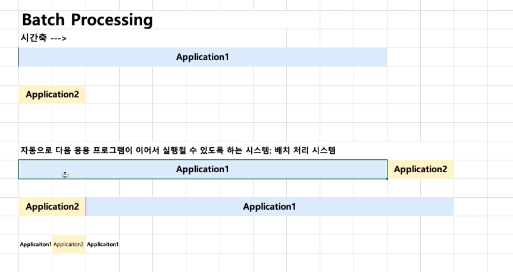

# 제 4강 운영체제 역사 (1950-1960년대 초반)
## 1950년대~ 1960년대 초반
---
## 1950년대
- ENIAC: 첫번째 컴퓨터 
- 당시에는 운영체제가 없었다.
  - 1개의 응용프로그램을 실행시키는데도 바빴음
  - 응용 프로그램이 직접 시스템 자원을 제어

---
## 1960년대 초기
> 프로그램 종류도 많아지고, 사용자도 많아지기 시작함
- 철수: 프로그램1 - 예상 실행시간 12시간
- 영희: 프로그램2 - 예상 실행시간 1분
- 프로그램1 --> 프로그램2
- 프로그램2 --> 프로그램1(뭔가 자동으로 프로그램2가 끝나면 프로그램1을 시작해줄 것이 필요함)
- 그것이 **배치 처리 시스템** (batch processing system) 출현
  - 여러 응용프로그램을 등록시켜두면 순차적으로 실행하는 시스템
  - 배치 처리 시스템을 기반으로 운영체제가 출현 
---
## 배치 처리 시스템(batch processing system)

---
## 정리
- 1950년대
  - 운영체제가 없었음
  - 응용프로그램이 직접 시스템자원을 제어하며 실행
- 1960년대
  - 배치 처리 시스템 출현, 운영체제가 출현

   

