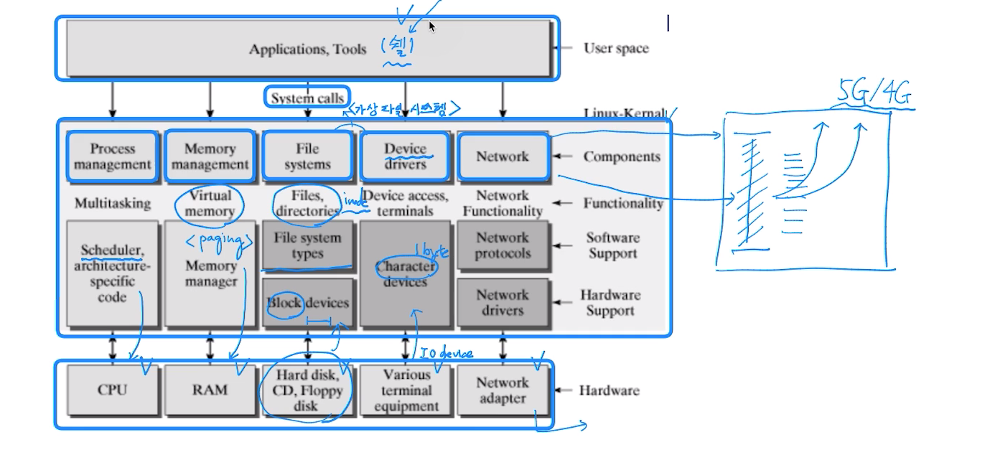
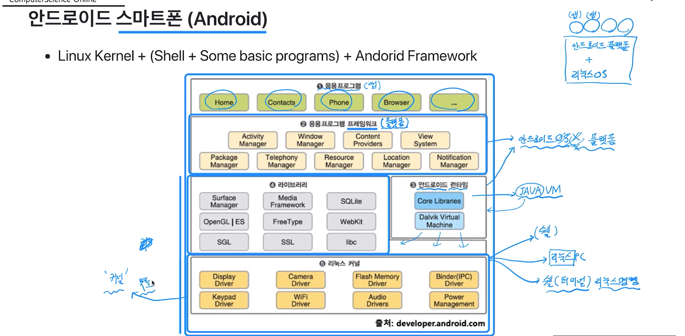
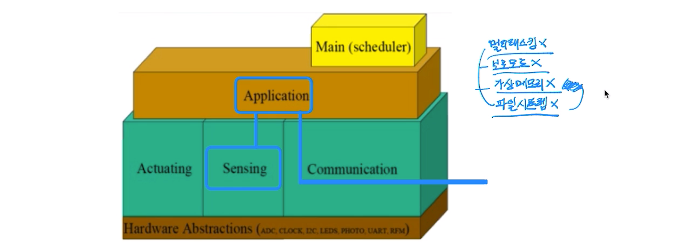

# 50강 실제 최신 운영체제 이해 및 운영체제 총정리 (총정리 강의)
## 실제 운영체제의 이해 
### - 운영체제 이해를 바탕으로 하는 실제 운영체제 구조 및 설계
- 리눅스 운영체제 
  - 리눅스 커널(운영체제) + 시스템 프로그램(쉘) + 응용 프로그램 

---
## 쉘 종류 
- 쉘(shell): 사용자와 컴퓨터 하드웨어 또는 운영체제간 인터페이스 
  - 사용자의 명령을 해석해서 커널에 명령을 요청해주는 역할 
  - 관련된 시스템콜을 사용해서 프로그래밍이 작성되어 있다. 

- 쉘 종류 
  - Bourne-Again Shell(bash): GNU 프로젝트의 일환으로 개발됨, 리눅스 거의 디폴트임 
  - Bourne Shell(sh)
  - C Shell(csh)
  - Korn Shell(ksh): 유닉스에서 가장 많이 사용됨   

---
## 실제 운영체제의 이해 
- process management
  - 응용 프로그램은 여러개의 process로 관리됨 
  - process scheduler
    - process 실행, 종료 관리 
    - 인터럽트 처리 관리 
- memory management
  - 가상 메모리 
    - page 기반 메모리 관리 
- IO device management
  - VFS(Virtual File System)
  - file, Device drivers, Network 관리         

---
## 실제 운영체제의 이해 
- 시스템 프로그램 
  - 핵심은 쉘 
    - bash(Bourne-again shell)
    - 내부는 시스템콜을 호출하도록 구현 
  - 각 프로그래밍 언어 (라이브러리/시스템콜)
    - 필요시 해당 운영체제의 시스템콜 호출   

---
## 안드로이드 스마트폰(Android)
- Linux Kernel + (Shell + Some basic programs) + Android Framework 

---
## 가볍게 이해하기: IoT
- IoT: 사물인터넷(Internet of Things)
  - 각종 사물에 센서와 통신 기능을 내장하여 인터넷에 연결하는 기술 

## IoT와 운영체제 
- IoT 관련 OS - 초소형 기기의 경우, OS기능 최소화 
- TinyOS 예 
  - 멀티태스킹 x
  - 보호모드 x 
  - 가상메모리 x
  - 파일시스템 x

