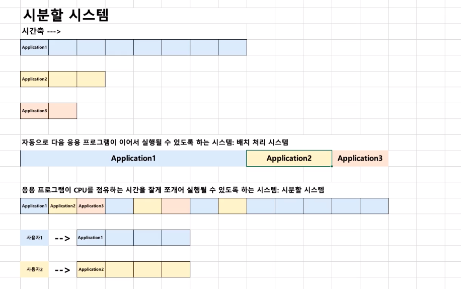

# 제 5강 운영체제 역사(1960년대 후반-시분할 시스템)
## 1960년대 후반
- 새로운 개념이 제안됨
  - 시분할 시스템(Time Sharing System)
  - 멀티 태스킹(Multi Tasking)
> 운영체제로 구현되진 않았음
---
## 시분할 시스템
- 응용 프로그램이 CPU시간을 잘게 쪼개서 여러개의 응용 프로그램을 동시에 실행하는 기법

---
## 시분할 시스템과 멀티 태스킹
- 시분할 시스템: 다중 사용자를 지원하고, 컴퓨터 응답시간을 최소화하는 시스템
- 멀티 태스킹: CPU를 가능한 많이 활용하도록 하는 기능(시간대비 CPU 사용율을 높이자.) 

