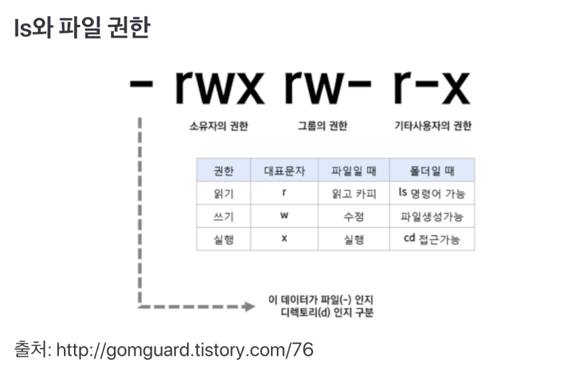

# 제 10강 쉘 기본 사용법 - 파일 및 권한 관리1
## sudo 명령어: root권한으로 실행하기 
- /etc/sudoers 설정 파일에서 다음과 같이 설정을 변경할 수 있음 
  - visudo가 설치되어 있다면, 해당 명령을 통해 설정 파일이 오픈되어 바로 수정 가능 

1. 특정 사용자가 sudo를 사용할 수 있도록 설정 
   - userid  ALL=(ALL)  ALL

2. 특정 그룹에 포함된 모든 사용자가 sudo를 사용할 수 있도록 설정 
   - %group  ALL=(ALL)  ALL

3. 패스워드 생략 설정   
   - %group  ALL=(ALL)  NOPASSWD: ALL 
   - userid  ALL=(ALL)  NOPASSWD: ALL 

- 예: sudo apt-get update

---
## 쉘로 시작하는 시스템 프로그래밍 기본 
### 쉘 사용법 정리 - 파일 및 권한 관련 명령어 
1. pwd: 현재 디렉토리 위치 

```shell
$ pwd 
```

2. cd: 디렉토리 이동 

```shell
$ cd /home/

// 자신의 아이디 홈 디렉토리로 감 
$ cd ~ 

// 상위 디렉토리로 이동
$ cd .. 

// 이동하기 전의 디렉토리로 이동 
$ cd - 
```

3. ls: 파일 목록 출력 
```shell
$ ls

// 숨김 파일, 파일 권한 및 소유자 포함하여 보여줌 
$ ls -al
```

4. ls와 와일드카드 

- *는 임의의 문자열 
- ?는 문자 하나 

```shell
// debi-로 시작하는 파일 전체 목록 출력 
$ ls debi* -al 
```

5. ls와 파일 권한 
- 파일마다 소유자, 소유자 그룹, 모든 사용자에 대해 
  - 읽고, 쓰고, 실행하는 권한 설정 
  - 소유자 접근 권한 정보는 inode에 저장 

```
$ ls debi* -al 
// 결과: -rwxr-xr-x 1 root root 120 Jul 19 19:28 debian-start
```  



- 사용자 
  - 소유자: 소유자에 대한 권한 
  - 그룹: 소유자가 속해있는 그룹에 대한 권한 
  - 공개: 모든 사용자들에 대한 권한 

- 퍼미션 종류, (권한 기호)
  - 읽기(r): 읽기 권한 
  - 쓰기(w): 쓰기 권한 
  - 실행(x): 실행 권한   

---
## 참고 - man : 사용법 알아보기 

- manual이라는 의미. 
```shell
// rm에 관련한 메뉴얼이 나옴 
$ man rm
```


