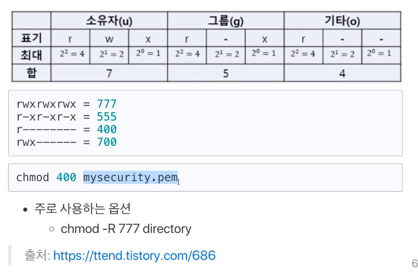

# 제 11강 쉘 기본 사용법 - 파일 및 권한관리2 
## 쉘 사용법 정리 - 파일 및 권한관리2

1. chmod: 파일 권한 변경 
- 기호 문자를 사용하는 방법 

| 누구에게? | 줄까?뺄까? | 무슨 권한을? |
|---|---|---|
| u 사용자 | + 더하기 | r 읽기 |
| g 그룹 | - 빼기 | w 쓰기 |
| o 기타 | = 설정 | x 실행 |
| a 전부 | | |

```
$ chmod g+rx test.c
$ chmod u+rw test.c
$ chmod ug+rw test.c
$ chmod u=rwx, g=rw, o=rx test.c
```

- 숫자를 사용하는 방법 
  - -R : recursive(재귀)라는 의미로 하위 디렉토리 전체 포함



2. chown: 소유자 변경 
- chown [옵션][소유자:소유그룹][파일]
- 주로 사용하는 옵션 
  - chown -R root:root directory
- 참고: 소유자 그룹 변경 
  - chgrp [옵션][그룹][파일]
  - 예: chgrp -R root directory

```
$ chown root:root file
$ chown root: file
$ chown :root file 
```

3. cat: 파일 보기 

```
$ cat mysql.cnf
# mysql.cnf 파일 내용이 출력됨 
```

6. head/tail: head는 파일 시작부분, tail은 끝 부분을 보여줌 

```
$ head mysql.cnf
# mysql.cnf 파일 앞부분만 출력됨(기본적으로 출력 라인수가 10으로 정해져있음) 

$ tail mysql.cnf
# mysql.cnf 파일 뒷부분만 출력됨(기본적으로 출력 라인수가 10으로 정해져있음) 
```

4. more: 파일보기(화면이 넘어갈 경우, 화면이 넘어가기 전까지 보여줌) 
- 스페이스바: 다음 페이지 
- 엔터: 한줄씩 

```
$ more mysql.cnf
# mysql.cnf 파일 내용이 출력됨 
```

5. rm: 파일 및 폴더 삭제 
- 주로 사용하는 명령어 형태 : rm -rf
- r 옵션: 하위 디렉토리 포함한 모든 파일 삭제 
- f 옵션: 강제로 파일이나 디렉토리 삭제 

```
$ rm -rf [directroy]
```

> 기본적으로 리눅스에는 휴지통이 없음 

---
## 정리 
- 쉘 - Bourne-Again Shell(bash): GNU 프로젝트의 일환으로 개발됨, 리눅스 거의 디폴트임 
- user 관련 명령: whoami, useradd, passwd, su - 명령 
- Directory, file 관련 명령: pwd, cd, ls, cat, head/tail, more, rm 
- Directory, file 권한 관련 명령: chmod, chown, chgrp
- 관리자 권한으로 실행하기: sudo 
- 다양한 옵션은 man 명령으로 매뉴얼 확인 가능함 