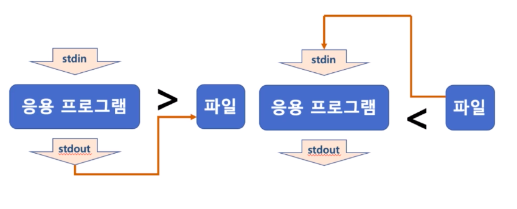
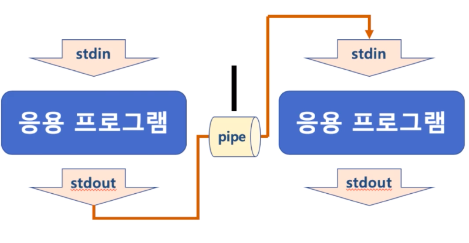
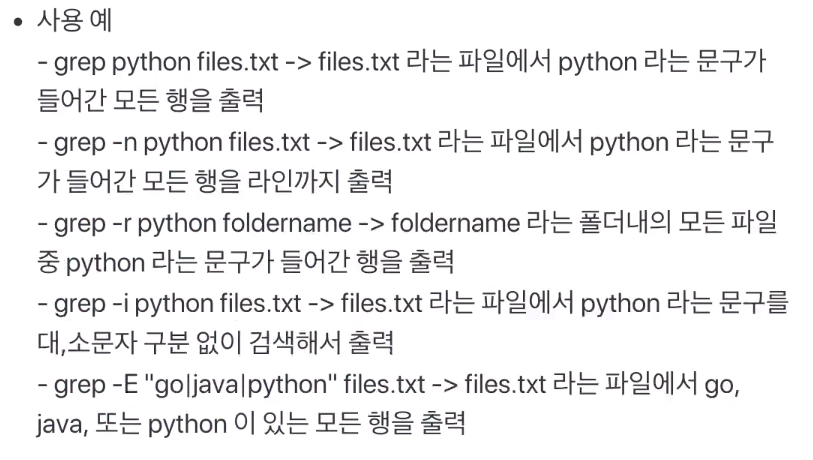

# 제 12강 쉘 기본 사용법 - 리다이렉션과 파이프
## 쉘 사용법 정리 - 리눅스 리다이렉션(redirection)과 파이프(pipe)
### Standard Stream(표준 입출력)
- command로 실행되는 프로세스는 세 가지 스트림을 가지고 있음 
  - 표준 입력 스트림(Standard Input Stream) - stdin 
  - 표준 출력 스트림(Standard Output Stream) - stdout
  - 오류 출력 스트림(Standard Error Stream) - stderr
- 모든 스트림은 일반적인 plain text로 console로 출력하도록 되어있음 

---
## 리다이렉션(redirection)
- 표준 스트림 흐름을 바꿔줄 수 있다. 
  - <, > 을 사용함 
  - 주로 명령어 표준 출력을 화면이 아닌 파일에 쓸 때 
  - 리다이렉션 하는 파일이 이미 존재하는 파일이라면 실행한 명령어 출력 스트림으로 덮어씀

  

- 예시 
  - ls > file.txt
    - ls로 출력되는 표준 출력 스트림의 방향을 file.txt로 바꿔줌(file.txt에 ls로 출력되는 결과가 저장됨)
  - head < file.txt 
    - file.txt의 파일 내용이 head라는 파일의 처음부터 10라인까지 출력해주는 명령으로 넣어짐(file.txt의 앞 10라인이 출력됨)
  - head < file.txt > file2.txt
    - file.txt의 파일 내용이 head로 들어가서, file.txt의 앞 10라인을 출력 
    - head의 출력 스트림이 다시 file2.txt로 들어감
    - head는 file.txt의 내용을 출력하지 않고, 해당 출력내용이 file2.txt에 저장됨(결과적으로 file.txt의 앞 10라인이 file2.txt에 저장됨)  
  - 기존 파일에 추가는 >> 또는 << 사용 
    - ls >> file.txt 
    - 기존에 있는 file.txt 파일 끝에 ls 출력결과를 추가해줌

---
## 파이프(pipe)
- 두 프로세스 사이에서 한 프로세스의 출력 스트림을 또 다른 프로세스의 입력 스트림 사용할 때 사용됨     



- 예시 
  - ls | grep file.txt
    - ls 명령을 통한 출력 내용이 grep 명령의 입력 스트림으로 들어감 
    - grep file.txt는 grep 명령의 입력 스트림을 검색해서 file.txt가 들어있는 입력 내용만 출력해줌
    - 따라서 ls 명령으로 해당 디렉토리/파일 중에 file.txt 파일이 있는지를 출력해줌 

### 참고 : grep 명령어 
- grep : 검색 명령 
- grep [-option][pattern][file or directory name]
```
<option>
-i : 영문의 대소문자를 구별하지 않는다.
-v : pattern을 포함하지 않는 라인을 출력한다. 
-n : 검색 결과의 각 행의 선두에 행 번호를 넣는다
-l : 파일명만 출력한다
-c : 패턴과 일치하는 라인의 개수만 출력한다.
-r : 하위 디렉토리까지 검색한다.
```



---
## 정리 
- Standard Stream
  - stdin, sdtout, stderr
  - redirection
    - 주로 명령어 표준 출력을 화면이 아닌 파일에 쓸 때 
  - pipe 
    - 두 프로세스 사이에서 앞에 있는 프로세스의 출력 스트림을 뒤에 있는 프로세스의 입력 스트림으로 사용할 때   
