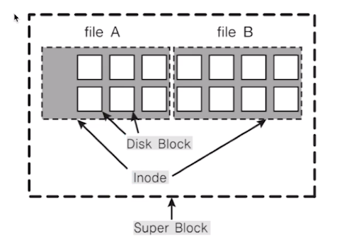

# 제 15강 리눅스 파일 시스템 
## 리눅스 파일 시스템과 관련 쉘 명령어 
### 운영체제 복습 

---
## 리눅스와 파일정리 
- 모든 것은 파일이라는 철학을 따름 
  - 모든 인터렉션은 파일을 읽고, 쓰는 것처럼 이루어져있음 
  - 마우스, 키보드와 같은 모든 디바이스 관련된 기술도 파일과 같이 다루어짐 
  - **모든 자원에 대한 추상화 인터페이스로 파일 인터페이스를 활용** 

---
## 가상 파일 시스템 
- 파일 네임스페이스 
  - A 드라이브(A:/), C 드라이브(C:/windows) (X)
  - 전역 네임스페이스 사용
    - /media/floofy/dave.jpg
    - 예: cat tty

  

---
## 슈퍼블록, inode와 파일 
- 슈퍼블록: 파일 시스템의 정보 
- 파일: inode 고유값과 자료구조에 의해 주요 정보관리 
  - '파일:inode'로 파일은 inode번호와 매핑되어 있음 
  - 파일 시스템에서는 inode 기반으로 파일 엑세스 
  - inode 기반 메타데이터 저장 

  

---
## 리눅스 파일 시스템(ext file system)과 inode

