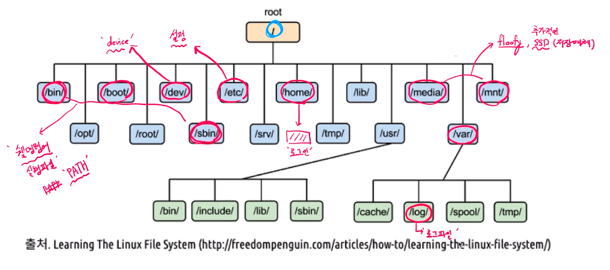

# 제 16강 리눅스 파일 시스템 탐색 
## 리눅스 파일시스템과 관련 쉘 명령어 
### 파일과 inode
- 리눅스 파일 탐색: 예 - /home/ubuntu/link.txt
  - 각 디렉토리 엔트리(dentry: directory entry)를 탐색 
    - 각 엔트리는 해당 디렉토리 파일/디렉토리 정보를 가지고 있음 
  - '/' dentry에서 'home'을 찾고, 'home'에서 'ubuntu'를 찾고, 'ubuntu'에서 link.txt 파일이름에 해당하는 inode를 얻음    

---
## 리눅스 파일 구조 (참고)
