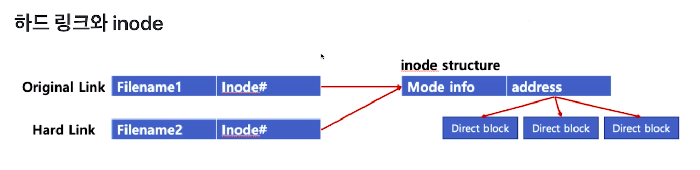

# 제 17강 파일 관련 쉘 명령어 - 하드 링크
## 하드 링크와 소프트 링크 
- cp 명령 : 파일 복사 
  - 1MB 사이즈를 가지고 있는 A파일을 B파일로 복사 
    - cp A B -> A와 B는 각각 물리적으로 10MB 파일로 저장 

- 하드 링크 : ln A B 
  - A와 B는 동일한 10MB 파일을 가리킴 
  - 즉, 동일한 파일을 가진 이름을 하나 더 만든 것일뿐 
    - 그래서 inode는 동일 
    - 전체 파일 용량은 달라지지 않음   
  - ls -i (파일 inode 확인하기) 
  - ls -al (완전 동일한 파일)
  - rm A로 A를 삭제하면? B는 그래도 해당 파일 접근 가능
    - 'A:해당 inode'이 정보만 삭제되고, inode를 가진 실제파일은 그대로 남음  
  - 동일한 파일 링크로 용량을 절약할 수 있음(같은 메모리를 참조할뿐)

   

- 소프트(심볼릭) 링크: ln -s A B 
  - Windows OS의 바로가기와 동일 
  - ls -al 하면, 소프트 링크 확인 가능 
  ```
  $ lrwxr-xr-r link3.txt -> link2.txt
  ```
  - rm A로 A를 삭제하면? B는 해당 파일 접근 불가 


